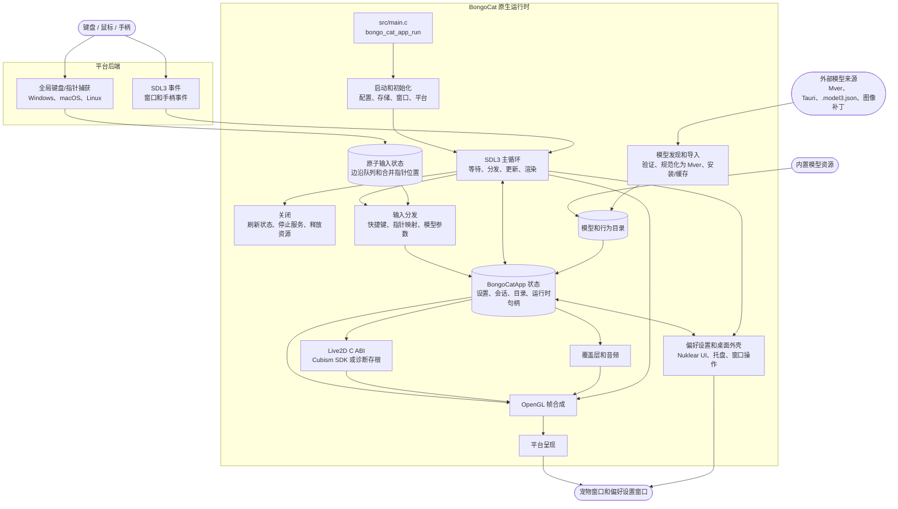

<div align="center">
  <a href="https://bongocat.pet" target="_blank">
    
  </a>
  <h1><a href="https://bongocat.pet" target="_blank">BongoCat</a></h1>
</div>

<p align="center">💘 C/C++ × SDL3 × OpenGL，搅拌在一起，尽情敲击！Bong~ Bongo Cat!!!</p>
<p align="center">
  选择语言 ❯ <a href="docs/README.en-US.md">English</a> • <strong>简体中文</strong> • <a href="docs/README.zh-Hant.md">繁體中文</a> • <a href="docs/README.fr-FR.md">Français</a> • <a href="docs/README.de-DE.md">Deutsch</a> • <a href="docs/README.ko-KR.md">한국어</a> • <a href="docs/README.pt-BR.md">Português</a> • <a href="docs/README.ru-RU.md">Русский</a> • <a href="docs/README.es-ES.md">Español</a> • <a href="docs/README.id-ID.md">Bahasa Indonesia</a>
</p>

> [!NOTE]
> 本仓库（**BongoCat-X**）是 [vladelaina/BongoCat](https://github.com/vladelaina/BongoCat) 的 fork 分支。本仓库与 Live2D 公司无关联、不附带 Live2D Cubism SDK，详见下方「Live2D 声明」章节。

<p align="center">
  <a href="LICENSE"></a>
  <a href="https://github.com/TianMengLucky/BongoCat-X"></a>

</p>

<div align="center"><video src="https://github.com/user-attachments/assets/75719230-9e49-4124-ae5a-8e35592c5d49" autoplay loop style="border-radius: 8px; max-width: 800px;"></video></div>

> [!TIP]
> 演示中使用的模型来自 [宇痕冫](https://space.bilibili.com/348616056)。
>
> 🎁 想找**免费**模型？我们与才华横溢的模型创作者合作，为您带来丰富多样的免费模型，同时持续探索更多有趣的桌面体验！欢迎访问我们的官方网站：[bongocat.pet](https://bongocat.pet/models)

<p align="center">
  <a href="https://bongocat.pet/models">
    
  </a>
</p>

<p align="center"></p>

## 📥 下载

- GitHub Releases

  从 [GitHub Releases](https://github.com/TianMengLucky/BongoCat-X/releases/latest) 下载最新版本。

  > [!IMPORTANT]
  > 官方 Release 为 **runtime-Core 构建**：内置 Live2D 渲染支持，但**不附带** Live2D Cubism Core 运行库（专有授权，不随包分发），**并非**无 Live2D 能力的诊断构建。未检测到 Core 时会回退到诊断后端并在设置窗口提示。

  **启用 Live2D 渲染（任选其一）：**

  1. **应用内导入（推荐）**：打开「设置 → 模型」页，点击「导入 Live2D Core」，选择 `Live2DCubismCore.dll` 或官方 Cubism SDK 的 zip 压缩包，导入后立即生效（无需重启）。
  2. **live2d 文件夹投放**：从 [Cubism SDK 下载页面](https://www.live2d.com/en/sdk/download/native/)（需同意 Live2D 许可协议）下载 **Cubism SDK for Native**，将 zip 或解压出的 `Live2DCubismCore.dll` 放入应用目录/数据目录下的 `live2d` 文件夹，重启应用后自动识别启用。

  源码构建时 SDK 的完整导入步骤见下方「Live2D / Cubism SDK」章节。

## ⚠️ Live2D 声明

本仓库与 Live2D 公司（Live2D Inc.）及其官方项目无任何关联。Live2D Cubism SDK 为 Live2D Inc. 的专有软件：本仓库不附带、不内置、也不分发该 SDK。构建前需按下方「Live2D / Cubism SDK」章节的说明，从 Live2D 官网自行下载并导入，使用须遵守 Live2D 的许可协议。

## 🛠️ 从源码构建

BongoCat 使用 CMake，需要 C11 编译器、C++17 编译器、CMake 3.24 或更高版本、桌面 OpenGL 开发文件，以及 Rust 工具链（通过 rustup 安装 cargo）：内存安全关键的解析器（SHA-256、图像解码、贡献者信息流、音频解码）位于 `src/rust/bongo-safe` crate 中，配置阶段由 Corrosion 自动构建。默认情况下，SDL3、yyjson、stb、miniaudio 和 Nuklear 会在配置阶段自动下载，因此首次配置需要网络连接。

请在项目根目录（包含 `CMakeLists.txt` 的目录）运行以下命令。

### 📋 平台前置条件

- **Windows：** Visual Studio 2022（安装“使用 C++ 的桌面开发”工作负载）和 CMake。请使用 MSVC 生成器；MinGW 可构建诊断后端，但不支持 Cubism SDK。
- **macOS：** Xcode Command Line Tools、CMake 和 Ninja。如果目标架构与主机默认架构不同，请通过 `CMAKE_OSX_ARCHITECTURES` 指定。
- **Linux（Debian/Ubuntu）：** GCC 或 Clang、Ninja，以及 OpenGL/X11 头文件：

  ```bash
  sudo apt-get update
  sudo apt-get install -y build-essential cmake ninja-build \
    libgl1-mesa-dev libx11-dev libxi-dev libxfixes-dev libfontconfig1-dev fonts-noto-cjk libcurl4-openssl-dev
  ```

### 🔧 配置与构建

在 Linux 和 macOS 上，请使用 Ninja 这样的单配置生成器：

```bash
cmake -S . -B build -G Ninja \
  -DCMAKE_BUILD_TYPE=Release \
  -DBONGO_CAT_FETCH_DEPS=ON
cmake --build build --parallel
```

在 Windows 上，请从 Visual Studio 2022 开发者命令行（或 MSVC 可用的其他命令行）运行：

```powershell
cmake -S . -B build -G "Visual Studio 17 2022" -A x64 `
  -DBONGO_CAT_FETCH_DEPS=ON
cmake --build build --config Release --parallel
```

可执行文件位于：Linux 的 `build/BongoCat`，macOS 的 `build/BongoCat.app/Contents/MacOS/BongoCat`，Visual Studio 构建的 Windows 版本为 `build/Release/BongoCat.exe`。

### 🧪 测试

CTest 目标默认启用。构建后运行：

```bash
ctest --test-dir build --output-on-failure
```

对于 Visual Studio 这类多配置生成器，请明确指定构建配置：

```powershell
ctest --test-dir build -C Release --output-on-failure
```

### 🎭 Live2D / Cubism SDK（可选：不安装也能编译）

Live2D Cubism SDK 为专有软件，**不会**随本仓库分发。SDK 现在是**可选的**：默认构建（`BONGO_CAT_REQUIRE_CUBISM=OFF`）在缺少 SDK 时也能正常配置和编译，产物是不含 Live2D 渲染的诊断后端——由于 Live2D 渲染器必须在编译期链接进二进制，运行时把 SDK 投放进去也**无法**为该构建补上渲染能力（仅带渲染器的版本会响应投放），它只用于启动与平台诊断。

若要构建带 Live2D 渲染支持的版本，仍需手动下载并导入 SDK：

1. 打开 [Cubism SDK 下载页面](https://www.live2d.com/en/sdk/download/native/)，同意 Live2D 专有软件许可协议，下载 **Cubism SDK for Native**（项目按 `5-r.5` 版本构建和测试）。
2. 解压压缩包。若解压出的文件夹名为 `CubismSdkForNative-5-r.5`，请将其重命名为 `CubismSdkForNative` 并放到 `vendor/` 目录下，使目录树包含 `Core/` 和 `Framework/`。
3. 较新的 SDK 压缩包不再自带 GLEW。请下载 [GLEW 2.2.0](https://github.com/nigels-com/glew/releases/download/glew-2.2.0/glew-2.2.0.zip) 并解压到 `vendor/CubismSdkForNative/Samples/OpenGL/thirdParty/glew`（该目录下应直接包含 `include/GL/glew.h` 和 `src/glew.c`）。

也可以将 SDK 保存在任意位置，并通过参数显式指定路径：

```bash
cmake -S . -B build -G Ninja \
  -DCMAKE_BUILD_TYPE=Release \
  -DBONGO_CAT_CUBISM_SDK=/path/to/CubismSdkForNative
```

SDK 必须包含 Core 库、Framework 源码，以及 `cmake/Cubism.cmake` 所要求布局中的 OpenGL GLEW 第三方目录。Windows Cubism 构建需要 Visual Studio 2022。SDK 就位后照常配置即可得到带 Live2D 渲染的版本；`BONGO_CAT_REQUIRE_CUBISM=ON` 的作用是让 SDK 缺失时配置直接失败并打印导入方法（发布流水线使用），没有必要时保持默认的 `OFF` 即可。

> [!TIP]
> Windows 用户无需重新构建即可启用 Live2D 渲染：在应用内打开「设置 → 模型」页，点击「导入 Live2D Core」，选择 `Live2DCubismCore.dll` 或官方 Cubism SDK 的 zip 压缩包，导入后立即生效（无需重启）。

> [!NOTE]
> 本仓库官方 Release 提供的安装包为 runtime-Core 构建：内置 Live2D 渲染支持，但**不附带 Core 运行库**。启动时会先检查 `live2d` 文件夹——把 `Live2DCubismCore.dll` 或官方 SDK zip 放入应用目录/数据目录下的该文件夹，重启后即被自动识别启用；也可以在应用内「设置 → 模型」页点击「导入 Live2D Core」立即生效。没有检测到 Core 时会回退到诊断后端，并在设置窗口给出提示。

### ⚙️ CMake 选项

| 选项 | 默认值 | 说明 |
| --- | --- | --- |
| `BONGO_CAT_FETCH_DEPS` | `ON` | 使用 CMake `FetchContent` 下载固定版本的第三方依赖（含 Corrosion 与 Rust crate 依赖）。仅当 SDL3、yyjson、stb、miniaudio、Nuklear 和 Corrosion 已可供 CMake 使用时才设为 `OFF`。 |
| `BONGO_CAT_CUBISM_SDK` | `vendor/CubismSdkForNative` | Cubism SDK for Native 的路径。 |
| `BONGO_CAT_REQUIRE_CUBISM` | `OFF` | SDK 缺失时是否让配置失败。默认 `OFF`：缺失时构建不带 Live2D 渲染的诊断后端；设为 `ON` 则要求 SDK 必须存在（发布 CI 使用）。 |
| `BONGO_CAT_WARNINGS_AS_ERRORS` | `OFF` | 将本地编译器警告视为错误。 |

离线构建时将 `BONGO_CAT_FETCH_DEPS=OFF`，并提供 SDL3（包括 `SDL3-static`）和 yyjson 的 CMake 包配置；如果 stb、Nuklear 和 miniaudio 无法自动发现，还需提供其包含目录：

```bash
cmake -S . -B build -G Ninja \
  -DCMAKE_BUILD_TYPE=Release \
  -DBONGO_CAT_FETCH_DEPS=OFF \
  -DBONGO_CAT_STB_INCLUDE_DIR=/path/to/stb \
  -DBONGO_CAT_NUKLEAR_INCLUDE_DIR=/path/to/nuklear \
  -DBONGO_CAT_MINIAUDIO_INCLUDE_DIR=/path/to/miniaudio
```

## 📌 项目状态


See [Insights / Pulse](https://github.com/TianMengLucky/BongoCat-X/pulse) for live charts.


## 📜 许可证

BongoCat 源代码和本地运行时采用 [AGPL-3.0-only](../LICENSE) 许可证。

默认内置模型模式（`standard`）仍采用 MIT 许可证。`resources/assets/models/standard`、`keyboard` 和 `gamepad` 中捆绑的模型资源受单独的 [MIT 许可证声明](../LICENSE-MIT) 覆盖。该 MIT 许可证仅适用于模型资源及其配套美术作品，不会改变 BongoCat 源代码或本地运行时的许可证。

## 🧭 技术架构

当前原生版本基于 C/C++、SDL3 和 OpenGL 构建。下图重点展示运行时数据流；构建与打包细节请参阅 CMake 文件。

### 🔄 运行时所有权与帧调度

每个进程拥有一个 `BongoCatApp` 和一个主线程事件/渲染循环。平台监听器在输入边界处停止：

```text
平台监听器（键盘/指针）
            |
            v
  C11 输入状态（原子边沿队列 + 合并后的指针位置）
            |
            v
  主线程应用 <----- SDL3 事件
            |
            v
  模型参数、覆盖层和 UI 状态
            |
            v
  模型更新 -> OpenGL 合成 -> 平台呈现
```

Windows Raw Input 接收器、macOS Quartz 事件 tap 和 Linux XInput2 监听器运行在主循环之外。按键和鼠标按钮边沿进入有界原子队列，移动量单独合并，并通过 SDL 事件唤醒主线程，避免高频移动挤出按键事件。Windows 使用独立消息窗口，以 `RIDEV_INPUTSINK | RIDEV_DEVNOTIFY` 订阅后台键鼠输入并保留普通窗口消息；其他程序隐藏或锁定光标时，模型使用设备上报的移动量，桌面跟随则读取 SDL 提供的系统光标位置。接收器分别管理各设备的按下状态，在设备拔出或输入桌面切换时清理。Windows 不再安装输入钩子或使用 DirectInput，也不向游戏发送输入。SDL3 窗口、偏好设置和手柄事件仍在主线程处理，平台监听器不会直接调用 Live2D、覆盖层或 UI 代码。

`bongo_cat_app_run` 负责更新、关闭和次级进程参数，确保主进程的单实例所有权，分配应用状态，执行初始化，进入 `bongo_cat_app_loop`，随后按定义顺序刷新状态并销毁资源。初始化会加载配置和存储路径、定位资源、创建 SDL/OpenGL 宠物窗口、初始化平台后端、创建 Live2D/覆盖层/音频服务、扫描内置/已安装/附近的模型来源，并加载可用模型。`BongoCatApp` 持有设置、会话状态、模型和行为目录、平台句柄及运行时服务句柄。

已安装的模型包使用 Mver 作为规范格式。导入流程会解析选中的文件或目录，发现并验证候选项，生成包身份指纹，将 Tauri 来源转换为 Mver，应用图像补丁，并将规范化包提交到 `models_root`。随后生成运行时适配器并刷新目录。附近来源只在不安装源目录的情况下被发现；其适配器和检查结果缓存在 `models_root` 之外的 `cache_root` 下。

每次主循环迭代都会等待 SDL/原生唤醒，或等待最早的帧、UI、动画和指针命中截止时间（最长 250 毫秒）。循环分发排队的 SDL 事件，清空原子输入队列并执行释放恢复，更新窗口和模型刷新状态，然后应用输入参数。启用 Cubism 时，模型截止时间遵循 `settings.model.max_fps`（默认为 60 FPS）；诊断构建使用 100 毫秒的后备间隔。模型经过的时间最多计为 250 毫秒，并拆分为最多八个子步，每个子步目标不超过 1/30 秒。

常规宠物路径仅在窗口可见、未最小化且标记为脏时渲染。每帧先清空背景，绘制模型，再合成指针、按键和效果覆盖层，最后调用平台呈现器。预览操作可以请求立即渲染，截图渲染可以跳过呈现。macOS 和 Linux 直接交换 SDL OpenGL 窗口；Windows 在未启用分层呈现时直接交换，否则读取帧缓冲并调用 `UpdateLayeredWindow`。偏好设置 UI 拥有独立的 SDL/OpenGL 窗口，并单独渲染和呈现。

C 运行时调用 `include/bongo_cat/model.h` 中声明的 ABI。Live2D 桥接和 Cubism 实现在 `src/live2d` 中，仅在启用 Cubism SDK 时使用 C++17；其余本地运行时使用 C11。Cubism 类型保持在不透明 C 句柄之后；当 SDK 不可用时，`src/live2d/live2d_stub.c` 提供诊断后端。



## ❓ 常见问题

### 🔒 BongoCat 会记录我的键盘或鼠标输入吗？

不会。BongoCat 在本地处理键盘和鼠标输入，用于驱动动画和快捷键。它不会记录或上传按键、鼠标操作或其他交互数据。配置也只保存在本地，应用不包含广告、分析工具或用户跟踪代码。执行更新检查时只会请求公开的版本元数据，不会发送输入、配置或使用数据。

### Linux Wayland 输入

X11 默认使用 XInput2。Wayland 的实验性 evdev 输入默认关闭；阅读
[输入权限风险](../SECURITY.md#linux-input) 后，可以为单次启动显式启用：

```sh
BONGOCAT_ENABLE_EVDEV=1 ./build/BongoCat
```

这个开关不会授予设备权限。不要为此以 root 身份运行程序，或把账户加入
`input` 组。原始输入可能包含密码框里的按键，监听不会在锁屏或切换会话时自动暂停。
退出程序才会停止监听，隐藏宠物不会停止；不带该变量重新启动即可恢复默认后端。
鼠标跟随使用未经加速的设备位移，窗口定位、点击穿透和置顶仍取决于 Wayland 合成器。

### 🖼️ 为什么使用 OpenGL 而不是 Vulkan？

这不是因为 Vulkan 不好，而是 BongoCat 不需要那种程度的复杂性。应用主要渲染一个 Live2D 模型、少量 UI 图层和透明桌面窗口，OpenGL 已能轻松满足需求，并且能自然地与 SDL3 及 Cubism 的 OpenGL 渲染器配合。迁移到 Vulkan 将需要在三个桌面平台维护更多渲染和同步代码，却不会为用户带来明显提升。对于 BongoCat 当前的工作负载，OpenGL 让渲染器更精简、更易调试和维护，同时仍能提供所需性能。

## 🙏 特别感谢
> [!TIP]
> BongoCat 的每一步都得益于开源精神。我们衷心感谢所有社区贡献者的无私奉献（按贡献日期先后排序列于下方）。正是你们的支持，让桌面陪伴更加自由与真诚。❤️‍🔥

<a href="https://github.com/TianMengLucky/BongoCat-X/graphs/contributors">
    
</a>

---

<div align="center">
版权所有 © 2026 - **BongoCat**<br>
By vladelaina<br>
Fork maintained by [TianMengLucky](https://github.com/TianMengLucky)<br>
Made with ❤️ & ⌨️
</div>
