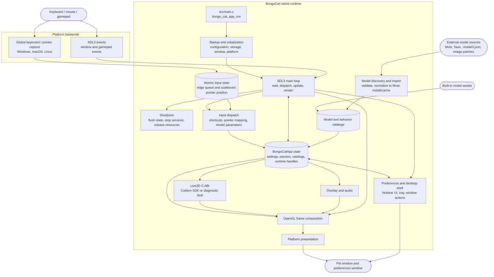

<div align="center">
  <a href="https://bongocat.pet" target="_blank">
    
  </a>
  
  <h1>
    <a href="https://bongocat.pet" target="_blank" style="text-decoration: none; color: inherit;">BongoCat</a>
  </h1>
</div>

<!-- Project Description + Rocket Icon -->
<p align="center"> 
 💘C × SDL3 × OpenGL — Three Mysterious Forces, United as One! Bong~ Bongocat!!!
</p>
<p align="center">
<strong>English</strong> • <a href="../README.md">简体中文</a> • <a href="README.zh-Hant.md">繁體中文</a> • <a href="README.fr-FR.md">Français</a> • <a href="README.de-DE.md">Deutsch</a> • <a href="README.ko-KR.md">한국어</a> • <a href="README.pt-BR.md">Português</a> • <a href="README.ru-RU.md">Русский</a> • <a href="README.es-ES.md">Español</a> • <a href="README.id-ID.md">Bahasa Indonesia</a>
</p>
> [!NOTE]
> This repository (**BongoCat-X**) is a fork of [vladelaina/BongoCat](https://github.com/vladelaina/BongoCat). It is not affiliated with Live2D Inc. and does not bundle the Cubism SDK - see the Live2D Disclaimer section below.

<p align="center">
  <a href="LICENSE"></a>
  <a href="https://github.com/TianMengLucky/BongoCat-X"></a>

</p>

<!-- Demo Video -->
<div align="center" style="margin-bottom: 30px;">
  <video src="https://github.com/user-attachments/assets/75719230-9e49-4124-ae5a-8e35592c5d49
" autoplay loop style="border-radius: 8px; max-width: 800px;"></video>
</div>


> [!TIP]
> The model featured in this demonstration is from [宇痕冫](https://space.bilibili.com/348616056).
>
> 🎁 Looking for **free** models? We work with talented model creators to bring you a wide variety of free models, while continuously exploring more fun desktop experiences! Visit our official website: [bongocat.pet](https://bongocat.pet/models)
<p align="center">
  <a href="https://bongocat.pet/models">
    
  </a>
</p>

<p align="center">
    
  </p>

## 📥 Download

- GitHub Releases

  Download the latest release from [GitHub Releases](https://github.com/TianMengLucky/BongoCat-X/releases/latest).

  > [!IMPORTANT]
  > Official releases are **runtime-Core builds**: Live2D rendering support is built in, but the Live2D Cubism Core runtime is **not bundled** (proprietary license, never shipped with the packages). These are **not** diagnostic builds without Live2D. When no Core is found the app falls back to the diagnostic backend and shows a hint in the settings window.

  **Enable Live2D rendering (either way works):**

  1. **In-app import (recommended)**: open *Settings → Models* and click *Import Live2D Core*, then pick a `Live2DCubismCore.dll` or the official Cubism SDK zip. Takes effect immediately, no restart needed.
  2. **Drop into the live2d folder**: download **Cubism SDK for Native** from the [official download page](https://www.live2d.com/en/sdk/download/native/) (accept Live2D's license), then put the zip or the extracted `Live2DCubismCore.dll` into the `live2d` folder next to the app or inside the data directory and restart the app.

  For full SDK import steps when building from source, see the "Live2D / Cubism SDK" section below.

## ⚠️ Live2D Disclaimer

This repository is not affiliated with Live2D Inc. or its official projects in any way. The Live2D Cubism SDK is proprietary software of Live2D Inc.: it is not bundled, embedded, or distributed with this repository. To build with Live2D support, download and import it yourself from the official Live2D website as described in the "Live2D / Cubism SDK" section below, and follow Live2D's license terms.

## 🛠️ Build From Source

BongoCat uses CMake and requires a C11 compiler, a C++17 compiler, CMake 3.24
or newer, desktop OpenGL development files, and a Rust toolchain (cargo, e.g.
via rustup): the memory-safety-critical parsers (SHA-256, image decoding, the
contributor feed, audio decoding) live in the `src/rust/bongo-safe` crate,
which Corrosion builds at configure time. SDL3, yyjson, stb, miniaudio,
and Nuklear are downloaded at configure time by default, so the first
configuration needs network access.

Run the commands below from the project root (the directory containing
`CMakeLists.txt`).

### 📋 Platform Prerequisites

- **Windows:** Visual Studio 2022 with the Desktop C++ workload and CMake.
  Use the MSVC generator; MinGW can build the diagnostic backend but is not
  supported for the Cubism SDK.
- **macOS:** Xcode Command Line Tools, CMake, and Ninja. Select an architecture
  with `CMAKE_OSX_ARCHITECTURES` when it differs from the host default.
- **Linux (Debian/Ubuntu):** GCC or Clang, Ninja, and the OpenGL/X11 headers:

  ```bash
  sudo apt-get update
  sudo apt-get install -y build-essential cmake ninja-build \
    libgl1-mesa-dev libx11-dev libxi-dev libxfixes-dev libfontconfig1-dev fonts-noto-cjk
  ```

### 🔧 Configure and Build

On Linux and macOS, use a single-configuration generator such as Ninja:

```bash
cmake -S . -B build -G Ninja \
  -DCMAKE_BUILD_TYPE=Release \
  -DBONGO_CAT_FETCH_DEPS=ON
cmake --build build --parallel
```

On Windows, run from a Visual Studio 2022 developer shell (or another shell
where MSVC is available):

```powershell
cmake -S . -B build -G "Visual Studio 17 2022" -A x64 `
  -DBONGO_CAT_FETCH_DEPS=ON
cmake --build build --config Release --parallel
```

The executable is written to `build/BongoCat` on Linux, to
`build/BongoCat.app/Contents/MacOS/BongoCat` on macOS, and to
`build/Release/BongoCat.exe` for Visual Studio builds.

### 🧪 Tests

CTest targets are enabled by default. Run them after building:

```bash
ctest --test-dir build --output-on-failure
```

For a multi-configuration generator such as Visual Studio, select the build
configuration explicitly:

```powershell
ctest --test-dir build -C Release --output-on-failure
```

### 🎭 Live2D / Cubism SDK (Optional — builds without it too)

The Live2D Cubism SDK is proprietary software and is **not** distributed with
this repository. The SDK is now **optional**: the default build
(`BONGO_CAT_REQUIRE_CUBISM=OFF`) configures and compiles fine without it and
produces a diagnostic backend without Live2D rendering. Because the Live2D
renderer must be compiled into the binary, dropping the SDK in at runtime
cannot give that build Live2D — only a build made with the SDK responds to
the runtime drop-in. The diagnostic backend exists for startup and platform
diagnostics only.
To build with Live2D rendering support, download and import the SDK
manually:

1. Open the [Cubism SDK download page](https://www.live2d.com/en/sdk/download/native/),
   accept the Live2D Proprietary Software License Agreement, and download
   **Cubism SDK for Native** (releases are built against the `5-r.5` SDK).
2. Extract the archive. If the extracted folder is named
   `CubismSdkForNative-5-r.5`, rename it to `CubismSdkForNative` and place it
   under `vendor/` so that the tree contains `Core/` and `Framework/`.
3. Newer SDK archives no longer bundle GLEW. Download
   [GLEW 2.2.0](https://github.com/nigels-com/glew/releases/download/glew-2.2.0/glew-2.2.0.zip)
   and extract it to `vendor/CubismSdkForNative/Samples/OpenGL/thirdParty/glew`
   (the directory that directly contains `include/GL/glew.h` and `src/glew.c`).

Alternatively, keep the SDK anywhere and pass its location explicitly:

```bash
cmake -S . -B build -G Ninja \
  -DCMAKE_BUILD_TYPE=Release \
  -DBONGO_CAT_CUBISM_SDK=/path/to/CubismSdkForNative
```

The SDK must contain its Core library, Framework sources, and the OpenGL GLEW
third-party tree in the layout expected by `cmake/Cubism.cmake`. Windows
Cubism builds require Visual Studio 2022. Once the SDK is in place, configure
as usual to get a build with Live2D rendering; `BONGO_CAT_REQUIRE_CUBISM=ON`
only makes configuration fail fast with import instructions when the SDK is
missing (release CI uses it). Leave it at the default `OFF` when you do not
need that.

> [!TIP]
> On Windows you can enable Live2D rendering without rebuilding: open
> Settings → Model in the app, click "Import Live2D Core" and select a
> `Live2DCubismCore.dll` or the official Cubism SDK zip. The change takes
> effect immediately, no restart needed.

> [!NOTE]
> Official releases of this repository are runtime-Core builds: they include
> the Live2D renderer but **do not bundle the Core runtime**. On startup the
> app checks the `live2d` folder — drop `Live2DCubismCore.dll` or the official
> SDK zip into it (next to the application or inside the data directory) and
> it is picked up automatically after a restart; you can also click "Import
> Live2D Core" under Settings → Models to activate it immediately. When no
> Core is found the app falls back to the diagnostic backend and shows a hint
> in the settings window.

### ⚙️ CMake Options

| Option | Default | Description |
| --- | --- | --- |
| `BONGO_CAT_FETCH_DEPS` | `ON` | Download the pinned third-party dependencies with CMake `FetchContent` (including Corrosion and the Rust crate dependencies). Set `OFF` only when SDL3, yyjson, stb, miniaudio, Nuklear, and Corrosion are already available to CMake. |
| `BONGO_CAT_CUBISM_SDK` | `vendor/CubismSdkForNative` | Path to the Cubism SDK for Native. |
| `BONGO_CAT_REQUIRE_CUBISM` | `OFF` | Whether a missing SDK fails configuration. Default `OFF`: a missing SDK builds the diagnostic backend without Live2D rendering; set `ON` to require the SDK (release CI uses it). |
| `BONGO_CAT_WARNINGS_AS_ERRORS` | `OFF` | Treat native compiler warnings as errors. |

For an offline build with `BONGO_CAT_FETCH_DEPS=OFF`, provide CMake package
configurations for SDL3 (including `SDL3-static`) and yyjson, plus the include
directories for stb, Nuklear, and miniaudio when they are not discoverable:

```bash
cmake -S . -B build -G Ninja \
  -DCMAKE_BUILD_TYPE=Release \
  -DBONGO_CAT_FETCH_DEPS=OFF \
  -DBONGO_CAT_STB_INCLUDE_DIR=/path/to/stb \
  -DBONGO_CAT_NUKLEAR_INCLUDE_DIR=/path/to/nuklear \
  -DBONGO_CAT_MINIAUDIO_INCLUDE_DIR=/path/to/miniaudio
```

## 📌 Project Status


See [Insights / Pulse](https://github.com/TianMengLucky/BongoCat-X/pulse) for live charts.


## 📜 License

The BongoCat source code and native runtime are licensed under
[AGPL-3.0-only](LICENSE).

The default built-in model mode (`standard`) remains MIT-licensed. The
bundled model assets in `resources/assets/models/standard`, `keyboard`, and
`gamepad` are covered by the separate [MIT license notice](LICENSE-MIT).
That MIT license applies to the model assets and their accompanying artwork
only; it does not relicense the BongoCat source code or native runtime.

## 🧭 Technical Architecture

> The current native version is built on C/C++, SDL3, and OpenGL. The diagram below focuses on the runtime data flow; build and packaging details live in CMake.

### 🔄 Runtime Ownership and Frame Scheduling

Each process owns one `BongoCatApp` and one main-thread event and render loop.
Platform listeners stop at the input boundary:

```text
Platform listeners
(keyboard / pointer)
            |
            v
  C11 input state
  (atomic edge queue + coalesced pointer position)
            |
            v
  main-thread application <----- SDL3 events
            |
            v
  model parameters, overlay, and UI state
            |
            v
  model update -> OpenGL composition -> platform presentation
```

The Windows Raw Input receiver, macOS Quartz event tap, and Linux XInput2 listener
run outside the main loop. They publish timestamped key and mouse-button edges
to the bounded atomic queue and coalesce pointer motion separately, so frequent
motion cannot displace ordered key and button edges. Native SDL wake events
notify the main thread. Windows registers a message-only receiver for background
keyboard and mouse input with `RIDEV_INPUTSINK | RIDEV_DEVNOTIFY`, preserving legacy
window messages. Device motion drives the model when another application hides
or locks the cursor; SDL supplies the desktop cursor position. The receiver
tracks held inputs per device and clears them on device removal or desktop
switches. It does not install input hooks, use DirectInput, or send input to games.
SDL3 window, preferences, and gamepad events
are handled on the main thread, where gamepad events are normalized before they
reach model parameters or shortcuts. No platform listener calls Live2D,
overlay, or UI code directly.

`bongo_cat_app_run` handles update-shutdown and secondary-process arguments,
enforces single-instance ownership for the primary process, allocates the
application state, runs initialization, enters `bongo_cat_app_loop`, and then
flushes state and destroys resources in a defined order. Initialization loads
configuration and storage paths, locates assets, creates the SDL/OpenGL pet
window, initializes the platform backend, creates the Live2D, overlay, and
audio services, scans the built-in/installed/nearby model sources, and loads a
usable model. `BongoCatApp` owns settings, session state, model and behavior
catalogs, platform handles, and runtime service handles.

Installed model packages use Mver as the canonical format. The import workflow
resolves a selected file or directory, discovers and validates candidates,
fingerprints package identity, converts Tauri sources to Mver, applies image
patches, and commits the normalized package under `models_root`. It then
generates the runtime adapter and refreshes the catalogs. Nearby sources are
discovered without installing their source tree; their adapters and inspection
results are cached outside `models_root` under `cache_root`.

Each main-loop iteration waits for SDL/native wakeups or the earliest pending
frame, UI, animation, or pointer-hit deadline (with a maximum wait of 250 ms).
It dispatches queued SDL events, drains the atomic input queue and release
recovery, updates window and model-refresh state, and applies input-derived
parameters. With Cubism enabled, the model deadline follows
`settings.model.max_fps` (60 FPS by default); diagnostic builds use a 100 ms
fallback interval. The elapsed model time is capped at 250 ms and split into up
to eight substeps, targeting no more than 1/30 s per substep.

The normal pet path renders only when the window is visible, not minimized, and
marked dirty. A frame clears the background, draws the model, and composites
pointer, key, and effect overlays before calling the platform presenter.
Preview operations can request immediate renders, while capture renders may
skip presentation. macOS and Linux swap the SDL OpenGL window directly.
Windows swaps directly when layered presentation is inactive and otherwise
reads back the frame for `UpdateLayeredWindow`. The preferences UI owns a
separate SDL/OpenGL window and is rendered and presented independently from
the pet window.

The C runtime calls the ABI declared in `include/bongo_cat/model.h`. The Live2D
bridge and Cubism implementation live in `src/live2d` and use C++17 only when
the Cubism SDK is enabled; the rest of the native runtime uses C11. Cubism
types remain behind opaque C handles, while `src/live2d/live2d_stub.c` provides
the diagnostic backend when the SDK is unavailable.



## ❓ FAQ

### 🔒 Does BongoCat record my keyboard or mouse input?

No. BongoCat processes keyboard and mouse input locally to drive animations
and shortcuts. It does not record or upload your keystrokes, mouse actions, or
other interaction data. Configuration is stored locally as well, and the app
contains no ads, analytics tools, or user-tracking code. When an update check
is performed, it only requests public release metadata; it does not send input,
configuration, or usage data.

### Linux Wayland Input

X11 uses XInput2 by default. Experimental evdev input for Wayland is off by
default. After reviewing [the input permission risks](SECURITY.md#linux-input),
it can be explicitly selected for one launch:

```sh
BONGOCAT_ENABLE_EVDEV=1 ./build/BongoCat
```

This does not grant device permissions. Do not run the app as root or add
your account to the `input` group to make it work. Raw input can include
password keystrokes and is not paused on screen lock or session switching.
Close the app to stop monitoring; hiding it does not stop input. Launch
without the variable to return to the default backend. Evdev mouse following
uses unaccelerated device motion; Wayland placement, click-through, and
always-on-top support still depend on the compositor.

### 🖼️ Why OpenGL instead of Vulkan?

We chose OpenGL not because Vulkan is bad, but because BongoCat does not need
that level of complexity. The app mainly renders one Live2D model, a few UI
layers, and a transparent desktop window. OpenGL already handles that
comfortably, and it works naturally with SDL3 and Cubism's OpenGL renderer.
Moving to Vulkan would mean maintaining much more rendering and synchronization
code across three desktop platforms, without a noticeable improvement for
users. For BongoCat's current workload, OpenGL keeps the renderer smaller,
easier to debug, and easier to maintain while still delivering the performance
we need.

## 🙏 Special Thanks
> [!TIP]
> Every step BongoCat takes is powered by the spirit of open source. We sincerely thank all our community contributors for their selfless contributions It is your support that makes desktop companionship more free and genuine.❤️‍🔥

<a href="https://github.com/TianMengLucky/BongoCat-X/graphs/contributors">
    
</a>

---

<div align="center">

Copyright © 2026 - **BongoCat**\
By vladelaina\
Fork maintained by [TianMengLucky](https://github.com/TianMengLucky)\
Made with ❤️ & ⌨️

</div>
