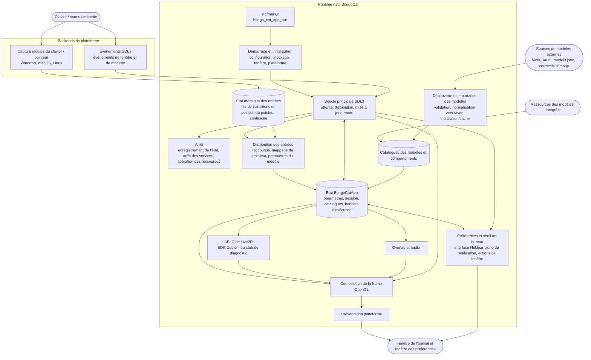

<div align="center">
  <a href="https://bongocat.pet" target="_blank">
    
  </a>

  <h1>
    <a href="https://bongocat.pet" target="_blank" style="text-decoration: none; color: inherit;">BongoCat</a>
  </h1>
</div>

<!-- Description du projet + icône fusée -->
<p align="center">
 💘C/C++ × SDL3 × OpenGL, mélangez le tout, assemblez-le ! Bong~ Bongo Cat !!!
</p>
<p align="center">
<a href="https://github.com/vladelaina/BongoCat/blob/main/README.md">English</a> • <a href="https://github.com/vladelaina/BongoCat/blob/main/docs/README.zh-CN.md">简体中文</a> • <a href="https://github.com/vladelaina/BongoCat/blob/main/docs/README.zh-Hant.md">繁體中文</a> • <a href="https://github.com/vladelaina/BongoCat/blob/main/docs/README.fr-FR.md"><strong>Français</strong></a> • <a href="https://github.com/vladelaina/BongoCat/blob/main/docs/README.de-DE.md">Deutsch</a> • <a href="https://github.com/vladelaina/BongoCat/blob/main/docs/README.ko-KR.md">한국어</a> • <a href="https://github.com/vladelaina/BongoCat/blob/main/docs/README.pt-BR.md">Português</a> • <a href="https://github.com/vladelaina/BongoCat/blob/main/docs/README.ru-RU.md">Русский</a> • <a href="https://github.com/vladelaina/BongoCat/blob/main/docs/README.es-ES.md">Español</a> • <a href="https://github.com/vladelaina/BongoCat/blob/main/docs/README.id-ID.md">Bahasa Indonesia</a>
</p>
<p align="center">
  <a href="https://github.com/vladelaina/BongoCat/blob/main/LICENSE"></a>
  <a href="https://github.com/vladelaina/BongoCat"></a>
  <a href="https://discord.gg/vf8jqnattk"></a>
  <a href="https://github.com/vladelaina/BongoCat/blob/main/docs/wechat.png"></a>
  <a href="https://qm.qq.com/q/cYlRBbvuda"></a>
</p>

<!-- Vidéo de démonstration -->
<div align="center" style="margin-bottom: 30px;">
  <video src="https://github.com/user-attachments/assets/75719230-9e49-4124-ae5a-8e35592c5d49
" autoplay loop style="border-radius: 8px; max-width: 800px;"></video>
</div>


> [!TIP]
> Le modèle présenté dans cette démonstration provient de [宇痕冫](https://space.bilibili.com/348616056).
>
> 🎁 Vous cherchez des modèles **gratuits** ? Nous collaborons avec des créateurs de modèles talentueux pour vous proposer une grande variété de modèles gratuits, tout en explorant continuellement de nouvelles expériences de bureau amusantes ! Rendez-vous sur notre site officiel : [bongocat.pet](https://bongocat.pet/models)


<p align="center">
  <a href="https://bongocat.pet/models">
    
  </a>
</p>

<p align="center">
    
  </p>

## 💬 Communauté QQ

Scannez le QR code avec QQ ou recherchez le groupe **211957388** pour rejoindre la communauté **BongoCat-X**.

<p align="center"></p>

## 📥 Téléchargement

<a href="https://apps.microsoft.com/detail/9p41mlsx72xw?referrer=appbadge" target="_self" >
	
</a>

- GitHub Releases ([v2.1.2](https://github.com/TianMengLucky/BongoCat-X/releases/tag/v2.1.2))

  Téléchargez la dernière version depuis [GitHub Releases](https://github.com/TianMengLucky/BongoCat-X/releases/latest).

  > [!IMPORTANT]
  > Les versions officielles sont des **builds runtime-Core** : la prise en charge du rendu Live2D est intégrée, mais la bibliothèque d'exécution Live2D Cubism Core n'est **pas fournie** (licence propriétaire, jamais distribuée avec les paquets). Ce ne sont **pas** des builds de diagnostic dépourvus de Live2D. Lorsqu'aucun Core n'est détecté, l'application revient au backend de diagnostic et affiche un avertissement dans la fenêtre de paramètres.

  **Activer le rendu Live2D (au choix) :**

  1. **Import dans l'application (recommandé)** : ouvrez *Paramètres → Plugins*, cliquez sur *Importer Live2D Core*, puis sélectionnez un fichier `Live2DCubismCore.dll` ou le zip officiel du SDK Cubism. Effet immédiat, sans redémarrage.
  2. **Dépôt dans le dossier live2d** : téléchargez **Cubism SDK for Native** depuis la [page de téléchargement officielle](https://www.live2d.com/en/sdk/download/native/) (acceptez la licence Live2D), puis placez le zip ou le `Live2DCubismCore.dll` extrait dans le dossier `live2d` à côté de l'application ou dans le répertoire de données, et redémarrez l'application.

  Pour les étapes complètes d'import du SDK lors d'une compilation depuis les sources, consultez la section « Live2D / Cubism SDK » ci-dessous.

## 🛠️ Compilation depuis les sources

BongoCat utilise CMake et nécessite un compilateur C11, un compilateur C++17,
CMake 3.24 ou une version plus récente, les fichiers de développement
OpenGL pour environnement de bureau et la toolchain Rust (cargo, par exemple
via rustup) : les analyseurs critiques pour la sûreté de la mémoire (SHA-256,
décodage d'images, le flux des contributeurs, décodage audio) se trouvent dans
le crate `src/rust/bongo-safe`, que Corrosion construit lors de la configuration.
SDL3, stb, miniaudio et Nuklear
sont téléchargés par défaut lors de la configuration ; la première configuration
nécessite donc un accès au réseau.

Exécutez les commandes ci-dessous depuis la racine du projet (le répertoire
contenant `CMakeLists.txt`).

### 📋 Prérequis par plateforme

- **Windows :** Visual Studio 2022 avec la charge de travail Desktop C++ et CMake.
  Utilisez le générateur MSVC ; MinGW peut compiler le backend de diagnostic,
  mais il n'est pas pris en charge par le SDK Cubism.
- **macOS :** Xcode Command Line Tools, CMake et Ninja. Définissez une architecture
  avec `CMAKE_OSX_ARCHITECTURES` lorsqu'elle diffère de l'architecture par défaut
  de la machine hôte.
- **Linux (Debian/Ubuntu) :** GCC ou Clang, Ninja ainsi que les en-têtes OpenGL/X11 :
  ```bash
  sudo apt-get update
  sudo apt-get install -y build-essential cmake ninja-build \
    libgl1-mesa-dev libx11-dev libxi-dev libxfixes-dev libcurl4-openssl-dev
  ```

### 🔧 Configuration et compilation

Sous Linux et macOS, utilisez un générateur à configuration unique tel que Ninja :

```bash
cmake -S . -B build -G Ninja \
  -DCMAKE_BUILD_TYPE=Release \
  -DBONGO_CAT_FETCH_DEPS=ON
cmake --build build --parallel
```

Sous Windows, exécutez les commandes depuis un shell de développement
Visual Studio 2022 (ou un autre shell dans lequel MSVC est disponible) :

```powershell
cmake -S . -B build -G "Visual Studio 17 2022" -A x64 `
  -DBONGO_CAT_FETCH_DEPS=ON
cmake --build build --config Release --parallel
```

L'exécutable est généré dans `build/BongoCat` sous Linux,
dans `build/BongoCat.app/Contents/MacOS/BongoCat` sous macOS,
et dans `build/Release/BongoCat.exe` pour les compilations Visual Studio.

### 🧪 Tests

Les cibles CTest sont activées par défaut. Exécutez-les après la compilation :

```bash
ctest --test-dir build --output-on-failure
```

Pour un générateur multi-configuration tel que Visual Studio,
sélectionnez explicitement la configuration de compilation :

```powershell
ctest --test-dir build -C Release --output-on-failure
```

### 🎭 Live2D / SDK Cubism (optionnel — se compile aussi sans)

Le SDK propriétaire Cubism reste facultatif. Sans lui, le programme et le plugin Inox2D sont compilés. Un plugin Live2D compatible et Cubism Core fourni séparément activent Live2D sans recompiler le programme. Le SDK produit le plugin C++ distinct.

Pour compiler avec la prise en charge du rendu Live2D, téléchargez et
importez le SDK manuellement :

1. Ouvrez la [page de téléchargement du SDK Cubism](https://www.live2d.com/en/sdk/download/native/), acceptez le Live2D
   Proprietary Software License Agreement et téléchargez **Cubism SDK for Native** (les
   versions sont compilées et testées avec le SDK `5-r.5`).
2. Extrayez l'archive. Si le dossier extrait s'appelle `CubismSdkForNative-5-r.5`,
   renommez-le en `CubismSdkForNative` et placez-le sous `vendor/` afin que l'arborescence
   contienne `Core/` et `Framework/`.
3. Les archives récentes du SDK n'incluent plus GLEW. Téléchargez
   [GLEW 2.2.0](https://github.com/nigels-com/glew/releases/download/glew-2.2.0/glew-2.2.0.zip) et extrayez-le dans
   `vendor/CubismSdkForNative/Samples/OpenGL/thirdParty/glew` (le répertoire contenant
   directement `include/GL/glew.h` et `src/glew.c`).

Vous pouvez aussi conserver le SDK où vous voulez et passer son emplacement explicitement :

```bash
cmake -S . -B build -G Ninja \
  -DCMAKE_BUILD_TYPE=Release \
  -DBONGO_CAT_CUBISM_SDK=/path/to/CubismSdkForNative
```

Le SDK doit contenir sa bibliothèque Core, les sources du Framework ainsi que
l'arborescence tierce OpenGL GLEW dans la structure attendue par
`cmake/Cubism.cmake`. Les compilations Cubism sous Windows nécessitent
Visual Studio 2022. Une fois le SDK en place, configurez comme d'habitude
pour obtenir une compilation avec rendu Live2D ; `BONGO_CAT_REQUIRE_CUBISM=ON`
ne sert qu'à faire échouer rapidement la configuration, avec les instructions
d'import, lorsque le SDK est absent (la CI de release l'utilise). Laissez-la
à la valeur par défaut `OFF` lorsque vous n'en avez pas besoin.

> [!TIP]
> Sous Windows, vous pouvez activer le rendu Live2D sans recompiler : ouvrez
> Paramètres → Modèle dans l’application, cliquez sur « Importer Live2D Core »
> et sélectionnez un fichier `Live2DCubismCore.dll` ou l’archive zip officielle
> du SDK Cubism. Le changement est immédiat, sans redémarrage.

> [!NOTE]
> Les versions officielles de ce dépôt sont des builds runtime-Core : elles
> incluent le rendu Live2D mais n'embarquent **pas** le runtime Core. Au
> démarrage, l'application vérifie le dossier `live2d` : déposez-y
> `Live2DCubismCore.dll` ou le zip officiel du SDK (à côté de l'application
> ou dans le répertoire de données) et il est pris en compte automatiquement
> après un redémarrage ; vous pouvez aussi cliquer sur « Importer Live2D
> Core » sous Paramètres → Modèle pour l'activer immédiatement. Lorsqu'aucun
> Core n'est trouvé, l'application revient sur le backend de diagnostic et
> affiche une indication dans la fenêtre des paramètres.

### ⚙️ Options CMake

| Option | Valeur par défaut | Description |
| --- | --- | --- |
| `BONGO_CAT_FETCH_DEPS` | `ON` | Télécharge les dépendances tierces aux versions épinglées via `FetchContent` de CMake (y compris Corrosion et les dépendances du crate Rust). Définissez cette option sur `OFF` uniquement si SDL3, stb, miniaudio, Nuklear et Corrosion sont déjà accessibles à CMake. |
| `BONGO_CAT_CUBISM_SDK` | `vendor/CubismSdkForNative` | Chemin vers le Cubism SDK for Native. |
| `BONGO_CAT_REQUIRE_CUBISM` | `OFF` | Indique si l'absence du SDK fait échouer la configuration. Par défaut `OFF` : sans SDK, on compile le backend de diagnostic sans rendu Live2D ; mettez `ON` pour exiger le SDK (la CI de release l'utilise). |
| `BONGO_CAT_WARNINGS_AS_ERRORS` | `OFF` | Traite les avertissements du compilateur natif comme des erreurs. |

Pour une compilation hors ligne avec `BONGO_CAT_FETCH_DEPS=OFF`, fournissez
les configurations de paquets CMake pour SDL3 (y compris `SDL3-static`) ,
ainsi que les répertoires d'inclusion de stb, Nuklear et miniaudio lorsqu'ils ne
peuvent pas être détectés automatiquement :

```bash
cmake -S . -B build -G Ninja \
  -DCMAKE_BUILD_TYPE=Release \
  -DBONGO_CAT_FETCH_DEPS=OFF \
  -DBONGO_CAT_STB_INCLUDE_DIR=/path/to/stb \
  -DBONGO_CAT_NUKLEAR_INCLUDE_DIR=/path/to/nuklear \
  -DBONGO_CAT_MINIAUDIO_INCLUDE_DIR=/path/to/miniaudio
```

## 📌 État du projet


## 📜 Licence

Le code source et le runtime natif de BongoCat sont distribués sous licence
[AGPL-3.0-only](LICENSE).

Le mode de modèle intégré par défaut (`standard`) reste sous licence MIT.
Les ressources de modèles fournies dans `resources/assets/models/standard`,
`keyboard` et `gamepad` sont couvertes par la [licence MIT distincte](LICENSE-MIT).
Cette licence MIT s'applique uniquement aux ressources des modèles et aux
éléments graphiques qui les accompagnent ; elle ne modifie pas la licence du
code source ni du runtime natif de BongoCat.

## 🧭 Architecture technique

> La version native actuelle repose sur C/C++, SDL3 et OpenGL. Le diagramme ci-dessous se concentre sur le flux de données à l'exécution ; les détails de compilation et de packaging sont gérés par CMake.

### 🔄 Gestion du runtime et ordonnancement des frames

Chaque processus possède une instance de `BongoCatApp` ainsi qu'une boucle
principale d'événements et de rendu exécutée sur le thread principal.
Les écouteurs propres à chaque plateforme s'arrêtent à la frontière du
système d'entrée :

```text
Écouteurs de plateforme
(clavier / pointeur)
            |
            v
  État des entrées C11
  (file atomique de transitions + position du pointeur coalescée)
            |
            v
  application sur le thread principal <----- événements SDL3
            |
            v
  paramètres du modèle, overlay et état de l'interface
            |
            v
  mise à jour du modèle -> composition OpenGL -> présentation plateforme
```

Le récepteur Raw Input de Windows, l'event tap Quartz de macOS et l'écouteur
XInput2 de Linux s'exécutent en dehors de la boucle principale. Les transitions
des touches et des boutons utilisent une file atomique bornée ; les mouvements
sont regroupés séparément et des événements SDL réveillent le thread principal.
Windows utilise une fenêtre de messages avec `RIDEV_INPUTSINK | RIDEV_DEVNOTIFY`
pour recevoir les entrées en arrière-plan, en conservant les messages ordinaires.
Le modèle utilise les mouvements du périphérique lorsqu'une autre application
masque ou verrouille le curseur ; SDL fournit sa position sur le bureau.
Les états sont nettoyés au retrait d'un périphérique ou au changement de bureau.
Windows n'installe plus de hooks d'entrée et n'utilise plus DirectInput.

Les événements SDL3 liés aux fenêtres, aux préférences et aux manettes sont
traités sur le thread principal, où les événements de manette sont normalisés
avant d'atteindre les paramètres du modèle ou les raccourcis. Aucun écouteur
de plateforme n'appelle directement le code Live2D, celui de l'overlay ou
celui de l'interface utilisateur.

`bongo_cat_app_run` gère l'arrêt lié aux mises à jour ainsi que les arguments
des processus secondaires, impose une instance unique pour le processus
principal, alloue l'état de l'application, exécute l'initialisation, entre dans
`bongo_cat_app_loop`, puis enregistre l'état et libère les ressources dans un
ordre défini.

L'initialisation charge la configuration et les chemins de stockage, localise
les ressources, crée la fenêtre SDL/OpenGL de l'animal de compagnie, initialise
le backend de la plateforme, crée les services Live2D, d'overlay et audio,
analyse les sources de modèles intégrées, installées ou locales, puis charge
un modèle utilisable. `BongoCatApp` possède les paramètres, l'état de session,
les catalogues de modèles et de comportements, les handles de plateforme ainsi
que les handles des services d'exécution.

Les paquets de modèles installés utilisent Mver comme format canonique.
Le processus d'importation résout le fichier ou le répertoire sélectionné,
découvre et valide les candidats, calcule l'empreinte d'identité du paquet,
convertit les sources Tauri vers Mver, applique les correctifs d'image et
enregistre le paquet normalisé sous `models_root`. Il génère ensuite
l'adaptateur d'exécution et actualise les catalogues.

Les sources locales voisines sont découvertes sans installer leur arborescence
source ; leurs adaptateurs et résultats d'inspection sont mis en cache en dehors
de `models_root`, sous `cache_root`.

À chaque itération de la boucle principale, l'application attend un réveil
SDL/natif ou la première échéance en attente concernant une frame, l'interface
utilisateur, une animation ou la détection du pointeur, avec un temps d'attente
maximal de 250 ms. Elle distribue ensuite les événements SDL en attente, vide
la file atomique des entrées et traite la récupération des relâchements, met à
jour l'état de la fenêtre et du rafraîchissement des modèles, puis applique les
paramètres dérivés des entrées.

Lorsque Cubism est activé, l'échéance de mise à jour du modèle suit
`settings.model.max_fps` (60 FPS par défaut) ; les compilations de diagnostic
utilisent un intervalle de secours de 100 ms. Le temps écoulé du modèle est
plafonné à 250 ms et divisé en un maximum de huit sous-étapes, avec pour
objectif de ne pas dépasser 1/30 s par sous-étape.

Dans le fonctionnement normal de l'animal de compagnie, le rendu n'est effectué
que lorsque la fenêtre est visible, non réduite et marquée comme nécessitant
un rafraîchissement. Une frame efface l'arrière-plan, dessine le modèle et
compose les overlays du pointeur, des touches et des effets avant d'appeler
le système de présentation de la plateforme.

Les opérations d'aperçu peuvent demander un rendu immédiat, tandis que les
rendus destinés à une capture peuvent ignorer la présentation. macOS et Linux
effectuent directement le swap de la fenêtre OpenGL SDL. Windows effectue
également directement le swap lorsque la présentation en couches est inactive ;
dans le cas contraire, la frame est relue pour `UpdateLayeredWindow`.

L'interface des préférences possède une fenêtre SDL/OpenGL distincte, rendue et
présentée indépendamment de la fenêtre de l'animal de compagnie.

Le runtime C appelle l'ABI déclarée dans `include/bongo_cat/model.h`.
Le pont Live2D et l'implémentation Cubism se trouvent dans `src/live2d` et
n'utilisent C++17 que lorsque le SDK Cubism est activé ; le reste du runtime
natif utilise C11. Les types Cubism restent masqués derrière des handles C
opaques, tandis que `src/live2d/live2d_stub.c` fournit le backend de diagnostic
lorsque le SDK n'est pas disponible.



## ❓ FAQ

### 🔒 BongoCat enregistre-t-il les entrées de mon clavier ou de ma souris ?

Non. BongoCat traite localement les entrées du clavier et de la souris afin de
piloter les animations et les raccourcis. Il n'enregistre ni ne téléverse vos
frappes au clavier, vos actions de souris ou toute autre donnée d'interaction.

La configuration est également stockée localement, et l'application ne contient
ni publicité, ni outil d'analyse, ni code de suivi des utilisateurs. Lorsqu'une
vérification de mise à jour est effectuée, l'application demande uniquement les
métadonnées publiques des versions ; elle n'envoie aucune donnée d'entrée,
de configuration ou d'utilisation.

### 🖼️ Où en est la prise en charge de Vulkan / Metal ?

Paramètres → Application → Moteur de rendu permet de basculer immédiatement : OpenGL ↔ Vulkan sur Windows / Linux x64, OpenGL ↔ Metal sur macOS. Système utilise OpenGL par défaut. L’envoi des textures natives, le dessin Cubism, la lecture GPU et le rechargement sont raccordés ; le modèle et les mouvements/expressions sélectionnés sont conservés. Un échec d’initialisation ou de rechargement rétablit OpenGL. Vulkan/Metal restent expérimentaux : calques des touches/effets/pointeur et mise à jour dynamique asynchrone des textures nécessitent OpenGL. Les textures natives appliquent les limites de qualité/taille au chargement. Les moteurs natifs mettent en cache le fond de table, l’incluent dans le cadre ajusté et arrondissent les quatre coins sur le GPU sans texture plein écran supplémentaire.

L’optimisation des rendus volumineux apparaît uniquement avec Vulkan et est désactivée par défaut. Les trois sous-options sont enregistrées séparément ; les changements rechargent le modèle. Inox2D Vulkan propose l’enregistrement parallèle et les grands blocs mémoire. Live2D Vulkan propose VMA et l’enregistrement parallèle avec mélange classique, sans nœuds hors écran ni masques haute précision. Live2D exige 128 Drawables pour les buffers secondaires et 128 instantanés dessinables pour utiliser jusqu’à quatre threads ; les autres modèles conservent le chemin séquentiel du SDK. Live2D Vulkan Bindless utilise une table de 64 textures d’atlas au maximum avec mélange classique et sans nœuds hors écran ; le chemin précédent est conservé si les capacités du périphérique sont insuffisantes. Inox2D Bindless n’est pas implémenté. Les grands pools peuvent utiliser plus de mémoire ; les gains de performance restent à mesurer.

Les compilations SDK activent `BONGO_CAT_CUBISM_VULKAN=ON` sur Windows / Linux x64 (`glslangValidator` ou `glslang`, paquet Linux `glslang-tools` ; Vulkan 1.3 à l’exécution) et `BONGO_CAT_CUBISM_METAL=ON` sur macOS (outils Metal de Xcode). Utilisez `OFF` pour désactiver l’extension. Les sources Metal et `.metallib` sont incluses uniquement sur macOS ; Vulkan et `.spv` uniquement sur Windows / Linux x64, avec les variantes de mélange. Les compilations de diagnostic sans SDK omettent ces ressources Live2D. GitHub Actions prépare les outils et vérifie les ressources par plateforme. Les contrôles statiques ont été exécutés ; compilation et GPU restent à valider. Voir [intégration et validation](live2d-vulkan-metal.md).

## État du projet


## 🙏 Remerciements
> [!TIP]
> Chaque pas de BongoCat est porté par l'esprit de l'open source. Nous remercions sincèrement tous les contributeurs de la communauté pour leurs contributions désintéressées (listées ci-dessous par ordre chronologique de contribution). C'est votre soutien qui rend l'accompagnement sur le bureau plus libre et plus authentique.❤️‍🔥


<a href="https://bongocat.pet">
    
</a>


[linux.do](https://linux.do/t/topic/2845597)
---

<div align="center">

Copyright © 2026 - **BongoCat**\
Par vladelaina\
Fait avec ❤️ & ⌨️

</div>

### Plugins de rendu dynamiques

Préférences → Plugins permet d’installer, d’activer et de supprimer des moteurs de rendu locaux. Passez à un autre moteur avant de modifier un plugin actif. Live2D utilise un plugin C++ ; Inochi2D utilise le plugin Rust Inox2D avec OpenGL, Vulkan (Windows/Linux) et Metal (macOS), sans wgpu. L’importation identifie d’abord le contenu du modèle (`.model3.json`, `.inp`, `.inx`). Toutes les données JSON sont lues et écrites en Rust.

Les versions portables Windows sont distribuées sous forme d’archives ZIP. Conservez le dossier extrait `plugins` à côté de l’exécutable. Voir [Plugins de rendu](model-plugins.md) pour les paquets, les dépendances hors ligne, l’ABI, les paramètres et les limites de compatibilité.

Chaque push sur `dev` qui modifie le code, les ressources ou la configuration de compilation publie une préversion GitHub. Les modifications de documentation seules sont ignorées ; aucun déclenchement programmé. Toutes les plateformes compilent le commit poussé. La dernière version stable reste inchangée.

Les préversions nocturnes réutilisent la [page nightly](https://github.com/TianMengLucky/BongoCat-X/releases/tag/nightly), actualisent le tag et remplacent les fichiers aux noms fixes. Les plateformes en échec conservent leurs fichiers précédents.

### Linux Wayland / evdev

L’entrée evdev expérimentale sous Linux Wayland s’active avec `BONGOCAT_ENABLE_EVDEV=1`. Les périphériques sont d’abord ouverts en lecture seule comme utilisateur normal. En cas de refus, une installation protégée demande une authentification via `/usr/bin/sudo`, ouvre les périphériques puis abandonne immédiatement les privilèges et redémarre avant l’initialisation de SDL, des paramètres et des modèles. Le programme, sudo et leurs répertoires parents doivent appartenir à root et ne pas être modifiables par le groupe ou les autres utilisateurs. Les installations de développement et portables nécessitent des autorisations distinctes. Le chemin de sudo se configure avec `BONGO_CAT_SUDO_EXECUTABLE`. Un échec arrête le démarrage ; aucun droit permanent n’est modifié. Seuls les périphériques présents au démarrage sont surveillés ; tout branchement ultérieur nécessite un redémarrage. Ne pas lancer directement comme root ni rejoindre le groupe `input`. Les entrées peuvent contenir des mots de passe ; verrouillage, changement de session et masquage de l’animal ne suspendent pas la surveillance.

[SECURITY.md](../SECURITY.md#linux-input)

Préférences → Préférences → Fenêtre permet de choisir une image de fond personnalisée : PNG, JPEG, WebP, BMP ou GIF (première image). Elle remplit la fenêtre centrée, en conservant ses proportions, et exclut le fond uni. Elle est copiée dans le dossier de données de l’application et reste disponible si l’original est déplacé. Limites : 64 Mo et 16 mégapixels. Compatible avec OpenGL, Vulkan et Metal.
