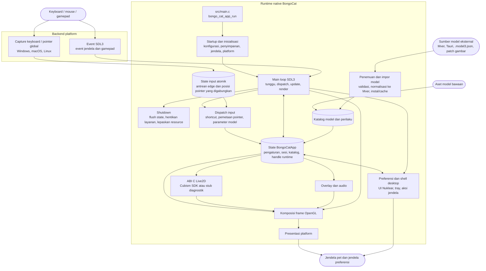

<div align="center">
  <a href="https://bongocat.pet" target="_blank">
    
  </a>

  <h1>
    <a href="https://bongocat.pet" target="_blank" style="text-decoration: none; color: inherit;">BongoCat</a>
  </h1>
</div>


<!-- Deskripsi Proyek + Ikon Roket -->
<p align="center">
 💘C/C++ × SDL3 × OpenGL, campur semuanya, satukan! Bong~ Bongo Cat!!!
</p>
<p align="center">
<a href="https://github.com/vladelaina/BongoCat/blob/main/README.md">English</a> • <a href="https://github.com/vladelaina/BongoCat/blob/main/docs/README.zh-CN.md">简体中文</a> • <a href="https://github.com/vladelaina/BongoCat/blob/main/docs/README.zh-Hant.md">繁體中文</a> • <a href="https://github.com/vladelaina/BongoCat/blob/main/docs/README.fr-FR.md">Français</a> • <a href="https://github.com/vladelaina/BongoCat/blob/main/docs/README.de-DE.md">Deutsch</a> • <a href="https://github.com/vladelaina/BongoCat/blob/main/docs/README.ko-KR.md">한국어</a> • <a href="https://github.com/vladelaina/BongoCat/blob/main/docs/README.pt-BR.md">Português</a> • <a href="https://github.com/vladelaina/BongoCat/blob/main/docs/README.ru-RU.md">Русский</a> • <a href="https://github.com/vladelaina/BongoCat/blob/main/docs/README.es-ES.md">Español</a> • <strong>Bahasa Indonesia</strong>
</p>
<p align="center">
  <a href="https://github.com/vladelaina/BongoCat/blob/main/LICENSE"></a>
  <a href="https://github.com/vladelaina/BongoCat"></a>
  <a href="https://discord.gg/vf8jqnattk"></a>
  <a href="https://github.com/vladelaina/BongoCat/blob/main/docs/wechat.png"></a>
  <a href="https://qm.qq.com/q/cYlRBbvuda"></a>
</p>


<!-- Video Demo -->
<div align="center" style="margin-bottom: 30px;">
  <video src="https://github.com/user-attachments/assets/75719230-9e49-4124-ae5a-8e35592c5d49
" autoplay loop style="border-radius: 8px; max-width: 800px;"></video>
</div>


> [!TIP]
> Model yang ditampilkan dalam demo ini berasal dari [宇痕冫](https://space.bilibili.com/348616056).
>
> 🎁 Mencari model **gratis**? Kami bekerja sama dengan kreator model berbakat untuk menghadirkan beragam model gratis, sambil terus mengeksplorasi pengalaman desktop yang lebih seru! Kunjungi situs resmi kami: [bongocat.pet](https://bongocat.pet/models)


<p align="center">
  <a href="https://bongocat.pet/models">
    
  </a>
</p>

<p align="center">
    
  </p>

## 💬 Komunitas QQ

Pindai kode QR dengan QQ atau cari grup **211957388** untuk bergabung dengan komunitas **BongoCat-X**.

<p align="center"></p>

## 📥 Unduh

<a href="https://apps.microsoft.com/detail/9p41mlsx72xw?referrer=appbadge" target="_self" >
	
</a>

- GitHub Releases ([v2.1.1](https://github.com/TianMengLucky/BongoCat-X/releases/tag/v2.1.1))

  Unduh rilis terbaru dari [GitHub Releases](https://github.com/TianMengLucky/BongoCat-X/releases/latest).

  > [!IMPORTANT]
  > Rilis resmi adalah **build runtime-Core**: dukungan rendering Live2D sudah tertanam, tetapi pustaka runtime Live2D Cubism Core **tidak disertakan** (lisensi berpemilik, tidak pernah didistribusikan bersama paket). Ini **bukan** build diagnostik tanpa Live2D. Jika Core tidak ditemukan, aplikasi beralih ke backend diagnostik dan menampilkan petunjuk di jalan pengaturan.

  **Mengaktifkan rendering Live2D (pilih salah satu):**

  1. **Impor dari aplikasi (disarankan)**: buka *Pengaturan → Plugin*, klik *Impor Live2D Core*, lalu pilih file `Live2DCubismCore.dll` atau zip resmi Cubism SDK. Berlaku seketika tanpa perlu memulai ulang.
  2. **Letakkan di folder live2d**: unduh **Cubism SDK for Native** dari [halaman unduhan resmi](https://www.live2d.com/en/sdk/download/native/) (harus menyetujui lisensi Live2D), lalu letakkan zip atau `Live2DCubismCore.dll` yang diekstrak ke folder `live2d` di samping aplikasi atau di dalam direktori data; setelah aplikasi dimulai ulang, ia dikenali secara otomatis.

  Untuk langkah impor SDK lengkap saat membangun dari kode sumber, lihat bagian «Live2D / Cubism SDK» di bawah.

## 🛠️ Membangun dari Kode Sumber

BongoCat menggunakan CMake dan memerlukan compiler C11, compiler C++17, CMake 3.24
atau yang lebih baru, file pengembangan OpenGL desktop, serta toolchain Rust
(cargo, misalnya via rustup): parser yang kritis terhadap keamanan memori
(SHA-256, decoding gambar, feed kontributor, decoding audio) berada di crate
`src/rust/bongo-safe`, yang dibangun oleh Corrosion saat konfigurasi. SDL3, stb,
miniaudio, dan Nuklear secara default diunduh saat proses konfigurasi, sehingga
konfigurasi pertama memerlukan akses jaringan.

Jalankan perintah berikut dari root proyek (direktori yang berisi
`CMakeLists.txt`).

### 📋 Prasyarat Platform

- **Windows:** Visual Studio 2022 dengan workload Desktop C++ dan CMake.
  Gunakan generator MSVC; MinGW dapat membangun backend diagnostik tetapi tidak
  didukung untuk Cubism SDK.
- **macOS:** Xcode Command Line Tools, CMake, dan Ninja. Pilih arsitektur dengan
  `CMAKE_OSX_ARCHITECTURES` jika berbeda dari default host.
- **Linux (Debian/Ubuntu):** GCC atau Clang, Ninja, serta header OpenGL/X11:

  ```bash
  sudo apt-get update
  sudo apt-get install -y build-essential cmake ninja-build \
    libgl1-mesa-dev libx11-dev libxi-dev libxfixes-dev
  ```

### 🔧 Konfigurasi dan Build

Di Linux dan macOS, gunakan generator single-configuration seperti Ninja:

```bash
cmake -S . -B build -G Ninja \
  -DCMAKE_BUILD_TYPE=Release \
  -DBONGO_CAT_FETCH_DEPS=ON
cmake --build build --parallel
```

Di Windows, jalankan dari shell developer Visual Studio 2022 (atau shell lain
yang menyediakan MSVC):

```powershell
cmake -S . -B build -G "Visual Studio 17 2022" -A x64 `
  -DBONGO_CAT_FETCH_DEPS=ON
cmake --build build --config Release --parallel
```

File executable dihasilkan di `build/BongoCat` pada Linux, di
`build/BongoCat.app/Contents/MacOS/BongoCat` di macOS, dan ke
`build/Release/BongoCat.exe` untuk build Visual Studio.

### 🧪 Pengujian

Target CTest diaktifkan secara default. Jalankan setelah proses build:

```bash
ctest --test-dir build --output-on-failure
```

Untuk generator multi-configuration seperti Visual Studio, pilih konfigurasi
build secara eksplisit:

```powershell
ctest --test-dir build -C Release --output-on-failure
```

### 🎭 Live2D / Cubism SDK (Opsional — tetap bisa dikompilasi tanpa SDK)

Cubism SDK tetap merupakan dependency proprietari opsional. Tanpanya, aplikasi dan plugin Inox2D tetap dapat dibangun. Plugin Live2D yang kompatibel beserta Cubism Core yang disediakan pengguna dapat mengaktifkan Live2D tanpa membangun ulang aplikasi. SDK digunakan untuk membangun plugin C++ terpisah.

1. Buka [halaman unduhan Cubism SDK](https://www.live2d.com/en/sdk/download/native/), setujui Live2D Proprietary Software
   License Agreement, lalu unduh **Cubism SDK for Native** (rilis dibangun dan diuji dengan
   SDK `5-r.5`).
2. Ekstrak arsipnya. Jika folder hasil ekstraksi bernama `CubismSdkForNative-5-r.5`, ubah
   namanya menjadi `CubismSdkForNative` dan letakkan di bawah `vendor/` sehingga pohon
   direktori memuat `Core/` dan `Framework/`.
3. Arsip SDK yang lebih baru tidak lagi menyertakan GLEW. Unduh
   [GLEW 2.2.0](https://github.com/nigels-com/glew/releases/download/glew-2.2.0/glew-2.2.0.zip) dan ekstrak ke
   `vendor/CubismSdkForNative/Samples/OpenGL/thirdParty/glew` (direktori yang langsung
   berisi `include/GL/glew.h` dan `src/glew.c`).

Anda juga dapat menyimpan SDK di lokasi mana pun dan meneruskan jalurnya secara eksplisit:

```bash
cmake -S . -B build -G Ninja \
  -DCMAKE_BUILD_TYPE=Release \
  -DBONGO_CAT_CUBISM_SDK=/path/to/CubismSdkForNative
```

SDK harus berisi Core library, source Framework, dan tree third-party OpenGL GLEW
dengan tata letak yang diharapkan oleh `cmake/Cubism.cmake`. Build Cubism di
Windows memerlukan Visual Studio 2022. Setelah SDK tersedia, lakukan konfigurasi
seperti biasa untuk mendapatkan build dengan rendering Live2D;
`BONGO_CAT_REQUIRE_CUBISM=ON` kini hanya menggagalkan konfigurasi lebih awal
dengan instruksi impor ketika SDK tidak ada (digunakan oleh CI rilis). Biarkan
pada default `OFF` bila Anda tidak membutuhkannya.

> [!TIP]
> Di Windows, rendering Live2D dapat diaktifkan tanpa membangun ulang: buka
> Pengaturan → Plugin di aplikasi, klik "Impor Live2D Core", lalu pilih berkas
> `Live2DCubismCore.dll` atau zip SDK Cubism resmi. Perubahan langsung berlaku
> tanpa perlu memulai ulang.

> [!NOTE]
> Paket Release resmi dari repositori ini adalah build runtime-Core: build
> tersebut menyertakan renderer Live2D, tetapi **tidak** menyertakan runtime
> Core. Saat startup, aplikasi memeriksa folder `live2d` — letakkan
> `Live2DCubismCore.dll` atau zip SDK resmi di sana (di samping aplikasi
> atau di direktori data) dan berkas itu akan terdeteksi otomatis setelah
> aplikasi dimulai ulang; Anda juga dapat mengeklik "Impor Live2D Core" di
> Pengaturan → Plugin untuk mengaktifkannya segera. Jika Core tidak
> ditemukan, aplikasi kembali ke backend diagnostik dan menampilkan
> petunjuk di jendela pengaturan.

### ⚙️ Opsi CMake

| Opsi | Default | Deskripsi |
| --- | --- | --- |
| `BONGO_CAT_FETCH_DEPS` | `ON` | Unduh dependency pihak ketiga yang versinya dipin menggunakan CMake `FetchContent` (termasuk Corrosion dan dependency crate Rust). Atur ke `OFF` hanya jika SDL3, stb, miniaudio, Nuklear, dan Corrosion sudah tersedia untuk CMake. |
| `BONGO_CAT_CUBISM_SDK` | `vendor/CubismSdkForNative` | Path ke Cubism SDK for Native. |
| `BONGO_CAT_REQUIRE_CUBISM` | `OFF` | Menentukan apakah SDK yang tidak tersedia menggagalkan konfigurasi. Default `OFF`: tanpa SDK dibangun backend diagnostik tanpa rendering Live2D; atur `ON` untuk mewajibkan SDK (digunakan oleh CI rilis). |
| `BONGO_CAT_WARNINGS_AS_ERRORS` | `OFF` | Perlakukan warning compiler native sebagai error. |

Untuk build offline dengan `BONGO_CAT_FETCH_DEPS=OFF`, sediakan konfigurasi
package CMake untuk SDL3 (termasuk `SDL3-static`) , serta direktori
include untuk stb, Nuklear, dan miniaudio jika tidak dapat ditemukan secara
otomatis:

```bash
cmake -S . -B build -G Ninja \
  -DCMAKE_BUILD_TYPE=Release \
  -DBONGO_CAT_FETCH_DEPS=OFF \
  -DBONGO_CAT_STB_INCLUDE_DIR=/path/to/stb \
  -DBONGO_CAT_NUKLEAR_INCLUDE_DIR=/path/to/nuklear \
  -DBONGO_CAT_MINIAUDIO_INCLUDE_DIR=/path/to/miniaudio
```

## 📌 Status Proyek


## 📜 Lisensi

Kode sumber dan runtime native BongoCat dilisensikan di bawah
[AGPL-3.0-only](../LICENSE).

Mode model bawaan default (`standard`) tetap berlisensi MIT. Aset model yang
disertakan dalam `resources/assets/models/standard`, `keyboard`, dan `gamepad`
dilindungi oleh [pemberitahuan lisensi MIT](../LICENSE-MIT) terpisah.
Lisensi MIT tersebut hanya berlaku untuk aset model dan artwork pendampingnya;
lisensi tersebut tidak mengubah lisensi kode sumber atau runtime native BongoCat.


## 🧭 Arsitektur Teknis

> Versi native saat ini dibangun dengan C/C++, SDL3, dan OpenGL. Diagram di bawah berfokus pada aliran data runtime; detail build dan packaging berada di CMake.

### 🔄 Kepemilikan Runtime dan Penjadwalan Frame

Setiap proses memiliki satu `BongoCatApp` serta satu event loop dan render loop
di thread utama. Listener platform berhenti pada batas input:

```text
Listener platform
(keyboard / pointer)
            |
            v
  state input C11
  (antrean edge atomik + posisi pointer yang digabungkan)
            |
            v
  aplikasi thread utama <----- event SDL3
            |
            v
  parameter model, overlay, dan state UI
            |
            v
  update model -> komposisi OpenGL -> presentasi platform
```

Penerima Raw Input Windows, event tap Quartz macOS, dan listener XInput2 Linux
berjalan di luar main loop. Perubahan tombol masuk ke antrean atomik berbatas,
gerakan digabungkan secara terpisah, dan event SDL membangunkan thread utama.
Windows memakai jendela khusus pesan dengan `RIDEV_INPUTSINK | RIDEV_DEVNOTIFY`
untuk menerima input latar belakang sambil mempertahankan pesan jendela biasa.
Model memakai gerakan perangkat ketika aplikasi lain menyembunyikan atau mengunci
kursor; SDL menyediakan posisi kursor desktop. Status tombol dibersihkan ketika
perangkat dilepas atau desktop input berganti. Windows tidak lagi memakai hook
input atau DirectInput. Event jendela SDL3, preferensi, dan gamepad ditangani di thread utama,
tempat event gamepad dinormalisasi sebelum mencapai parameter model atau
shortcut. Tidak ada listener platform yang memanggil kode Live2D, overlay, atau
UI secara langsung.

`bongo_cat_app_run` menangani update-shutdown dan argumen proses sekunder,
memastikan kepemilikan single-instance untuk proses utama, mengalokasikan state
aplikasi, menjalankan inisialisasi, masuk ke `bongo_cat_app_loop`, lalu melakukan
flush state dan menghancurkan resource dalam urutan yang terdefinisi.
Inisialisasi memuat konfigurasi dan path penyimpanan, menemukan aset, membuat
jendela pet SDL/OpenGL, menginisialisasi backend platform, membuat layanan
Live2D, overlay, dan audio, memindai sumber model bawaan/terpasang/terdekat, lalu
memuat model yang dapat digunakan. `BongoCatApp` memiliki pengaturan, state
sesi, katalog model dan perilaku, handle platform, serta handle layanan runtime.

Paket model yang terpasang menggunakan Mver sebagai format kanonis. Workflow
impor menentukan file atau direktori yang dipilih, menemukan dan memvalidasi
kandidat, membuat fingerprint identitas paket, mengonversi sumber Tauri ke Mver,
menerapkan patch gambar, lalu menyimpan paket yang sudah dinormalisasi di bawah
`models_root`. Setelah itu, workflow menghasilkan adapter runtime dan
memperbarui katalog. Sumber terdekat ditemukan tanpa memasang source tree-nya;
adapter dan hasil inspeksinya di-cache di luar `models_root` di bawah
`cache_root`.

Setiap iterasi main loop menunggu sinyal wakeup SDL/native atau deadline frame, UI,
animasi, atau pointer-hit terdekat yang masih tertunda (dengan waktu tunggu
maksimum 250 ms). Iterasi tersebut mendispatch event SDL yang mengantre,
menguras antrean input atomik dan release recovery, memperbarui state jendela
dan model-refresh, serta menerapkan parameter yang berasal dari input. Saat
Cubism aktif, deadline model mengikuti `settings.model.max_fps` (default 60 FPS);
build diagnostik menggunakan interval fallback 100 ms. Waktu model yang berlalu
dibatasi hingga 250 ms dan dibagi menjadi maksimal delapan substep, dengan
target tidak lebih dari 1/30 detik per substep.

Jalur render pet normal hanya melakukan render saat jendela terlihat, tidak diminimalkan,
dan ditandai dirty. Sebuah frame membersihkan latar belakang, menggambar model, dan
mengomposisikan overlay pointer, tombol, dan efek sebelum memanggil presenter
platform. Operasi preview dapat meminta render langsung, sedangkan render
capture dapat melewati presentasi. macOS dan Linux menukar jendela SDL OpenGL
secara langsung. Windows melakukan swap langsung saat layered presentation tidak
aktif; jika aktif, Windows membaca kembali frame untuk `UpdateLayeredWindow`.
UI preferensi memiliki jendela SDL/OpenGL terpisah yang dirender dan
dipresentasikan secara independen dari jendela pet.

Runtime C memanggil ABI yang dideklarasikan di `include/bongo_cat/model.h`.
Bridge Live2D dan implementasi Cubism berada di `src/live2d` dan hanya
menggunakan C++17 saat Cubism SDK diaktifkan; runtime native lainnya menggunakan
C11. Tipe Cubism tetap berada di balik handle C yang opaque, sedangkan
`src/live2d/live2d_stub.c` menyediakan backend diagnostik ketika SDK tidak
tersedia.




## ❓ FAQ

### 🔒 Apakah BongoCat merekam input keyboard atau mouse saya?

Tidak. BongoCat memproses input keyboard dan mouse secara lokal untuk
menggerakkan animasi dan shortcut. BongoCat tidak merekam atau mengunggah
keystroke, aksi mouse, atau data interaksi lainnya. Konfigurasi juga disimpan
secara lokal, dan aplikasi tidak memiliki iklan, alat analitik, atau kode
pelacakan pengguna. Saat pemeriksaan pembaruan dilakukan, aplikasi hanya meminta
metadata rilis publik; aplikasi tidak mengirim data input, konfigurasi, atau
penggunaan.

### 🖼️ Bagaimana progres dukungan Vulkan / Metal?

Pengaturan → Aplikasi → Backend Render berganti langsung tanpa memulai ulang: OpenGL ↔ Vulkan pada Windows / Linux x64, OpenGL ↔ Metal pada macOS. Sistem memakai OpenGL secara bawaan. Unggahan tekstur native, gambar Cubism, pembacaan GPU dan pemuatan ulang model telah terhubung; model serta gerakan/ekspresi pilihan dipertahankan. Kegagalan inisialisasi atau pemuatan memulihkan OpenGL. Vulkan/Metal masih eksperimental: overlay tombol/efek/penunjuk dan pembaruan tekstur dinamis asinkron memerlukan OpenGL. Tekstur native menerapkan batas kualitas/ukuran saat dimuat. Backend native menyimpan latar meja dalam cache, memasukkannya dalam batas bingkai rapat dan membulatkan empat sudut di GPU tanpa tekstur layar penuh tambahan.

Optimasi rendering besar nonaktif secara bawaan dan menampilkan fitur yang aktif; pergantian memuat ulang model. Inox2D Vulkan mendukung perekaman perintah paralel dan blok memori besar; Live2D Vulkan mendukung alokasi besar melalui VMA. Adegan kecil memakai perekaman serial. Bindless, komputasi asinkron, dan perekaman paralel Live2D belum diimplementasikan. OpenGL / Metal tidak menyediakan fitur ini. Pool besar dapat memakai lebih banyak memori.

Build SDK memakai `BONGO_CAT_CUBISM_VULKAN=ON` pada Windows / Linux x64 (`glslangValidator` atau `glslang`, paket Linux `glslang-tools`; Vulkan 1.3 saat dijalankan) dan `BONGO_CAT_CUBISM_METAL=ON` pada macOS (alat Metal Xcode). Pakai `OFF` untuk menonaktifkan ekstensi terkait. Sumber Metal dan `.metallib` hanya masuk macOS; Vulkan dan `.spv` hanya Windows / Linux x64, termasuk variasi blending. Build diagnostik tanpa SDK mengabaikan sumber daya Live2D ini. GitHub Actions menyiapkan alat dan memeriksa sumber daya per platform. Pemeriksaan statis telah dijalankan; build dan GPU belum diverifikasi. Lihat [integrasi dan validasi](live2d-vulkan-metal.md).

## Status Proyek


## 🙏 Ucapan Terima Kasih
> [!TIP]
> Setiap langkah BongoCat digerakkan oleh semangat open source. Kami dengan tulus berterima kasih kepada seluruh kontributor komunitas atas kontribusi mereka tanpa pamrih (tercantum di bawah berdasarkan urutan tanggal kontribusi). Dukungan Anda membuat pengalaman pendamping desktop menjadi lebih bebas dan autentik.❤️‍🔥


<a href="https://bongocat.pet">
    
</a>


[linux.do](https://linux.do/t/topic/2845597)
---

<div align="center">

Copyright © 2026 - **BongoCat**\
Oleh vladelaina\
Dibuat dengan ❤️ & ⌨️

</div>

### Plugin perender dinamis

Preferensi → Plugin mengelola pemasangan, pengaktifan, dan penghapusan perender lokal. Beralihlah ke perender lain sebelum mengubah plugin yang aktif. Live2D memakai plugin C++; Inochi2D memakai plugin Rust Inox2D dengan OpenGL, Vulkan (Windows/Linux), dan Metal (macOS), tanpa wgpu. Impor mengenali isi model terlebih dahulu (`.model3.json`, `.inp`, `.inx`). Seluruh pembacaan dan penulisan JSON dilakukan di Rust.

Rilis portabel Windows berbentuk arsip ZIP. Simpan folder hasil ekstraksi `plugins` di samping program. Lihat [Plugin perender](model-plugins.md) untuk pengemasan, dependensi luring, ABI, pemetaan parameter, dan batas kompatibilitas.

Setiap push ke `dev` yang mengubah kode, aset, atau konfigurasi build menerbitkan prarilis GitHub. Perubahan dokumentasi saja dilewati; tidak ada pemicu terjadwal. Semua platform membangun commit yang didorong. Prarilis tidak menggantikan rilis stabil terbaru.

Prarilis nightly memakai kembali [halaman nightly](https://github.com/TianMengLucky/BongoCat-X/releases/tag/nightly), memperbarui tag dan mengganti berkas bernama tetap. Platform yang gagal tetap menyimpan berkas sebelumnya.
