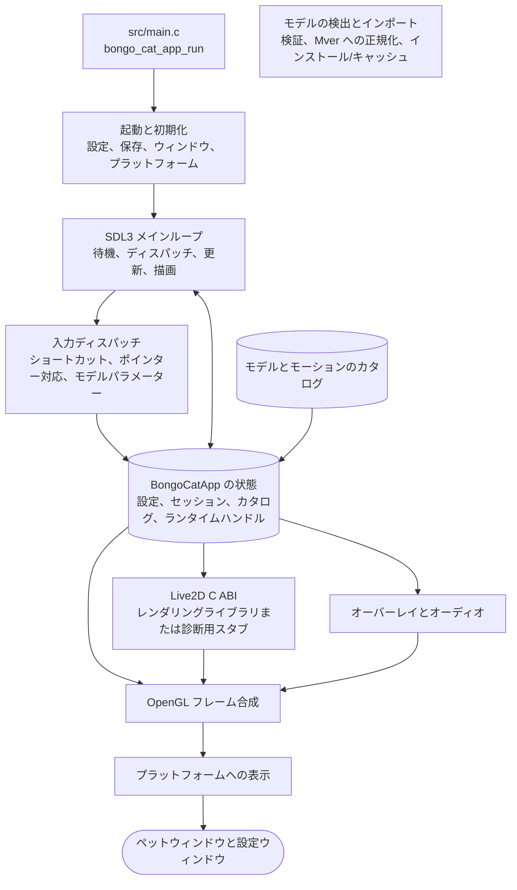

<div align="center">
  <a href="https://bongocat.pet" target="_blank">
    
  </a>
  <h1><a href="https://bongocat.pet" target="_blank">BongoCat</a></h1>
</div>

<p align="center"><strong>日本語</strong> • <a href="../README.md">简体中文</a> • <a href="README.zh-Hant.md">繁體中文</a> • <a href="README.fr-FR.md">Français</a> • <a href="README.de-DE.md">Deutsch</a> • <a href="README.ko-KR.md">한국어</a> • <a href="README.pt-BR.md">Português</a> • <a href="README.ru-RU.md">Русский</a> • <a href="README.es-ES.md">Español</a> • <a href="README.id-ID.md">Bahasa Indonesia</a></p>

> [!NOTE]
> このページは `README.md` の Live2D / Cubism SDK に関連するセクションのみを日本語化したものです。他のセクションは<a href="../README.md">简体中文</a>または各言語版の README を参照してください。

## ⚠️ Live2D 免責事項

このリポジトリは Live2D Inc. およびその公式プロジェクトとは一切関係ありません。Live2D Cubism SDK は Live2D Inc. の専有ソフトウェアであり、このリポジトリには同梱・埋め込み・再配布されていません。Live2D 対応でビルドする場合は、後述の「Live2D / Cubism SDK」セクションの手順に従って Live2D 公式サイトから自らダウンロードして取り込み、Live2D のライセンス条件に従って利用してください。

### 🎭 Live2D / Cubism SDK（任意 — インストールしなくてもビルドできます）

Live2D Cubism SDK は専有ソフトウェアであり、このリポジトリでは**配布されません**。いまや SDK はビルド時に**任意**です：既定のビルド（`BONGO_CAT_REQUIRE_CUBISM=OFF`）は SDK がなくても設定もコンパイルも正常に行えますが、得られるのは Live2D レンダリングを含まない診断用実行ファイルだけで、レンダリングライブラリも生成されません。Live2D レンダラーは独立した共有ライブラリ `bongo-cat-live2d-backend` に切り出されており、SDK が揃っているときにのみ生成されます。診断用実行ファイルも起動時にこのライブラリを探します：同一バージョンのレンダリングライブラリ（たとえば公式 Release に同梱されているもの）をアプリの隣や `live2d` フォルダーに置くだけで Live2D レンダリングが有効になりますが、SDK 本体だけを置いても効果はありません。この実行ファイル自体は起動とプラットフォーム診断のためのものです。Live2D レンダリング対応でビルドするには、SDK を手動でダウンロードして取り込みます：

1. [Cubism SDK ダウンロードページ](https://www.live2d.com/en/sdk/download/native/)を開き、Live2D 専有ソフトウェアライセンス契約に同意して **Cubism SDK for Native** をダウンロードします（リリースは `5-r.5` の SDK でビルド・テストされています）。
2. アーカイブを展開します。展開されたフォルダー名が `CubismSdkForNative-5-r.5` の場合は `CubismSdkForNative` にリネームし、`Core/` と `Framework/` が含まれるように `vendor/` の下に置きます。
3. 新しい SDK アーカイブには GLEW が含まれていません。[GLEW 2.2.0](https://github.com/nigels-com/glew/releases/download/glew-2.2.0/glew-2.2.0.zip) をダウンロードし、`vendor/CubismSdkForNative/Samples/OpenGL/thirdParty/glew`（`include/GL/glew.h` と `src/glew.c` を直接含むディレクトリ）に展開してください。

SDK を任意の場所に置き、そのパスを明示的に指定することもできます：

```bash
cmake -S . -B build -G Ninja \
  -DCMAKE_BUILD_TYPE=Release \
  -DBONGO_CAT_CUBISM_SDK=/path/to/CubismSdkForNative
```

SDK には Core ライブラリ、Framework のソースコード、および `cmake/Cubism.cmake` が期待するレイアウトの OpenGL GLEW サードパーティ製ディレクトリが含まれている必要があります。Windows の Cubism ビルドには Visual Studio 2022 が必要です。SDK を所定の位置に置いたら、通常どおり設定すれば Live2D レンダリング込みのビルドが得られます。実行ファイルに加えて、共有ライブラリ形式のレンダラー `bongo-cat-live2d-backend`（Linux では `libbongo-cat-live2d-backend.so`、macOS では `libbongo-cat-live2d-backend.dylib`、Windows では `bongo-cat-live2d-backend.dll`）も生成され、アプリは起動時にそれを実行ファイルの隣、実行ファイルの隣の `live2d/` サブフォルダー、データディレクトリ内の `live2d/` サブフォルダーの順に探して自動的に読み込みます。`BONGO_CAT_REQUIRE_CUBISM=ON` は、SDK がないときに設定をインポート手順付きですぐに失敗させるだけのものです（リリース CI が使用します）。その動作が必要ない場合は既定値の `OFF` のままにしてください。

> [!TIP]
> Live2D Core は再ビルドなしで有効化できます：アプリで「設定 → モデル」ページを開き、「Live2D Core をインポート」をクリックして、`Live2DCubismCore.dll` または公式 Cubism SDK の zip を選択してください。即座に反映され、再起動は不要です。

> [!NOTE]
> このリポジトリの公式 Release パッケージには Live2D レンダリングライブラリ（`bongo-cat-live2d-backend`）が同梱されていますが、Core ランタイムライブラリは**含まれていません**。起動時にアプリはレンダリングライブラリと Core をこの順序で確認します。アプリのディレクトリまたはデータディレクトリの `live2d` フォルダーに、レンダリングライブラリまたは `Live2DCubismCore.dll`（もしくは公式 SDK の zip）を入れて再起動すれば、自動的に認識されて有効になります。Core はアプリ内の「設定 → モデル」ページで「Live2D Core をインポート」をクリックすれば、再起動なしにすぐ有効にできます。レンダリングライブラリや Core がなくてもアプリは（診断モードで）通常どおり起動し、設定ウィンドウにどの部品が足りないか、どこへ置くべきかが表示されます。

### ⚙️ CMake オプション

| オプション | 既定値 | 説明 |
| --- | --- | --- |
| `BONGO_CAT_FETCH_DEPS` | `ON` | CMake の `FetchContent` で固定バージョンのサードパーティ依存関係をダウンロードします。SDL3、yyjson、stb、miniaudio、Nuklear がすでに CMake から利用できる場合に限り `OFF` に設定してください。 |
| `BONGO_CAT_CUBISM_SDK` | `vendor/CubismSdkForNative` | Cubism SDK for Native のパスです。 |
| `BONGO_CAT_REQUIRE_CUBISM` | `OFF` | SDK がないときに設定を失敗させるかどうかです（`bongo-cat-live2d-backend` レンダリングライブラリを生成するには SDK の存在が必要です）。既定値 `OFF`：SDK がない場合はレンダリングライブラリを作らず診断用実行ファイルのみをビルドします。`ON` に設定すると SDK の存在が必須になります（リリース CI が使用します）。 |
| `BONGO_CAT_WARNINGS_AS_ERRORS` | `OFF` | ネイティブコンパイラの警告をエラーとして扱います。 |

## 🧭 技術アーキテクチャ

C ランタイムは `include/bongo_cat/model.h` で宣言された ABI を呼び出します。Live2D ブリッジと Cubism 実装は `src/live2d` にあり、Cubism SDK が有効な場合にのみ C++17 で書かれ、独立した共有ライブラリ `bongo-cat-live2d-backend` にコンパイルされます。実行ファイルは `src/live2d/live2d_dispatch.c` のバージョン付き関数ポインターテーブルを通してのみこのライブラリを呼び出し、起動時にライブラリが見つからない場合は `src/live2d/live2d_stub.c` の診断用バックエンドで代替します。残りのネイティブランタイムは C11 を使用します。Cubism の型は不透明な C ハンドルの背後に隠され、Core ランタイムライブラリも実行ファイルには含まれず、プラットフォームのローダーが実行時に解決します。


