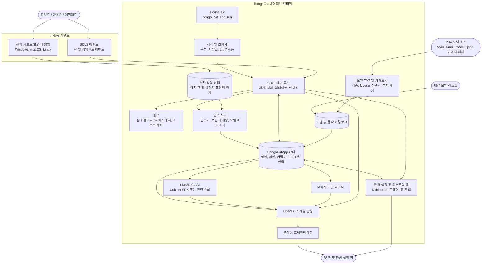

<div align="center">
  <a href="https://bongocat.pet" target="_blank">
    
  </a>
  <h1><a href="https://bongocat.pet" target="_blank">BongoCat</a></h1>
</div>

<p align="center">💘 C/C++ × SDL3 × OpenGL，함께 섞어서 마음껏 두드리세요! Bong~ Bongo Cat!!!</p>
<p align="center">
  언어 선택 ❯ <a href="https://github.com/vladelaina/BongoCat/blob/main/README.md">English</a> • <a href="https://github.com/vladelaina/BongoCat/blob/main/docs/README.zh-CN.md">简体中文</a> • <a href="https://github.com/vladelaina/BongoCat/blob/main/docs/README.zh-Hant.md">繁體中文</a> • <a href="https://github.com/vladelaina/BongoCat/blob/main/docs/README.fr-FR.md">Français</a> • <a href="https://github.com/vladelaina/BongoCat/blob/main/docs/README.de-DE.md">Deutsch</a> • <strong>한국어</strong> • <a href="https://github.com/vladelaina/BongoCat/blob/main/docs/README.pt-BR.md">Português</a> • <a href="https://github.com/vladelaina/BongoCat/blob/main/docs/README.ru-RU.md">Русский</a> • <a href="https://github.com/vladelaina/BongoCat/blob/main/docs/README.es-ES.md">Español</a> • <a href="https://github.com/vladelaina/BongoCat/blob/main/docs/README.id-ID.md">Bahasa Indonesia</a>
</p>
<p align="center">
  <a href="https://github.com/vladelaina/BongoCat/blob/main/LICENSE"></a>
  <a href="https://github.com/vladelaina/BongoCat"></a>
  <a href="https://discord.gg/vf8jqnattk"></a>
  <a href="https://github.com/vladelaina/BongoCat/blob/main/docs/wechat.png"></a>
  <a href="https://qm.qq.com/q/cYlRBbvuda"></a>
</p>

<div align="center"><video src="https://github.com/user-attachments/assets/75719230-9e49-4124-ae5a-8e35592c5d49" autoplay loop style="border-radius: 8px; max-width: 800px;"></video></div>

> [!TIP]
> 데모에 사용된 모델은 [宇痕冫](https://space.bilibili.com/348616056)님의 작품입니다.
>
> 🎁 **무료** 모델을 찾으시나요? 저희는 재능 있는 모델 크리에이터들과 협력하여 다양한 무료 모델을 제공하고, 더 재미있는 데스크톱 경험도 끊임없이 탐색하고 있습니다! 공식 웹사이트를 방문하세요: [bongocat.pet](https://bongocat.pet/models)

<p align="center">
  <a href="https://bongocat.pet/models">
    
  </a>
</p>

<p align="center"></p>

## 💬 QQ 커뮤니티

QQ로 QR 코드를 스캔하거나 그룹 번호 **211957388**을 검색하여 **BongoCat-X** 커뮤니티에 참여하세요.

<p align="center"></p>

## 📥 다운로드

<a href="https://apps.microsoft.com/detail/9p41mlsx72xw?referrer=appbadge" target="_self"></a>

- GitHub Releases ([v2.1.1](https://github.com/TianMengLucky/BongoCat-X/releases/tag/v2.1.1))

  [GitHub Releases](https://github.com/TianMengLucky/BongoCat-X/releases/latest)에서 최신 버전을 다운로드하세요.

  > [!IMPORTANT]
  > 공식 릴리스는 **runtime-Core 빌드**입니다: Live2D 렌더링 지원이 내장되어 있지만, Live2D Cubism Core 런타임 라이브러리는 **포함되지 않습니다**(독점 라이선스로 패키지에 절대 포함되지 않음). Live2D 없는 진단 빌드가 **아닙니다**. Core를 찾지 못하면 진단 백엔드로 전환되고 설정 창에 안내가 표시됩니다.

  **Live2D 렌더링 활성화 (둘 중 하나 선택):**

  1. **앱 내 가져오기 (권장)**: *설정 → 플러그인* 페이지를 열고 *Live2D Core 가져오기*를 클릭한 뒤 `Live2DCubismCore.dll` 또는 공식 Cubism SDK zip 파일을 선택하세요. 재시작 없이 즉시 적용됩니다.
  2. **live2d 폴더에 넣기**: [공식 다운로드 페이지](https://www.live2d.com/en/sdk/download/native/)에서(Live2D 라이선스에 동의 필요) **Cubism SDK for Native**를 다운로드하여 zip 또는 압축을 푼 `Live2DCubismCore.dll`을 앱 옆 또는 데이터 디렉터리의 `live2d` 폴더에 넣고 앱을 재시작하면 자동으로 인식됩니다.

  소스에서 빌드할 때의 전체 SDK 가져오기 절차는 아래 «Live2D / Cubism SDK» 섹션을 참고하세요.

## 🛠️ 소스 코드로 빌드하기

BongoCat은 CMake를 사용하며, C11 컴파일러, C++17 컴파일러, CMake 3.24 이상, 데스크톱 OpenGL 개발 파일, 그리고 Rust 툴체인(rustup을 통해 설치한 cargo)이 필요합니다. 메모리 안전성이 중요한 파서(SHA-256, 이미지 디코딩, 기여자 피드, 오디오 디코딩)는 `src/rust/bongo-safe` 크레이트에 있으며 Corrosion이 구성 단계에서 빌드합니다. 기본적으로 SDL3, stb, miniaudio 및 Nuklear는 구성 단계에서 자동으로 다운로드되므로, 첫 구성 시 네트워크 연결이 필요합니다.

프로젝트 루트 디렉토리(`CMakeLists.txt`가 있는 디렉토리)에서 다음 명령어를 실행하세요.

### 📋 플랫폼 사전 요구 사항

- **Windows:** Visual Studio 2022("C++를 사용한 데스크톱 개발" 워크로드 설치) 및 CMake. MSVC 생성기를 사용하세요. MinGW는 진단 백엔드를 빌드할 수 있지만 Cubism SDK를 지원하지 않습니다.
- **macOS:** Xcode Command Line Tools, CMake 및 Ninja. 대상 아키텍처가 호스트 기본 아키텍처와 다른 경우 `CMAKE_OSX_ARCHITECTURES`를 통해 지정하세요.
- **Linux(Debian/Ubuntu):** GCC 또는 Clang, Ninja, OpenGL/X11 헤더 파일:

  ```bash
  sudo apt-get update
  sudo apt-get install -y build-essential cmake ninja-build \
    libgl1-mesa-dev libx11-dev libxi-dev libxfixes-dev libcurl4-openssl-dev
  ```

### 🔧 구성 및 빌드

Linux 및 macOS에서는 Ninja와 같은 단일 구성 생성기를 사용하세요:

```bash
cmake -S . -B build -G Ninja \
  -DCMAKE_BUILD_TYPE=Release \
  -DBONGO_CAT_FETCH_DEPS=ON
cmake --build build --parallel
```

Windows에서는 Visual Studio 2022 개발자 명령 프롬프트(또는 MSVC를 사용할 수 있는 기타 명령줄)에서 다음을 실행하세요:

```powershell
cmake -S . -B build -G "Visual Studio 17 2022" -A x64 `
  -DBONGO_CAT_FETCH_DEPS=ON
cmake --build build --config Release --parallel
```

실행 파일 위치: Linux `build/BongoCat`, macOS `build/BongoCat.app/Contents/MacOS/BongoCat`, Visual Studio 빌드 Windows 버전 `build/Release/BongoCat.exe`.

### 🧪 테스트

CTest 대상은 기본적으로 활성화됩니다. 빌드 후 실행:

```bash
ctest --test-dir build --output-on-failure
```

Visual Studio와 같은 다중 구성 생성기의 경우 빌드 구성을 명시적으로 지정하세요:

```powershell
ctest --test-dir build -C Release --output-on-failure
```

### 🎭 Live2D / Cubism SDK (선택 사항 — 설치하지 않아도 빌드 가능)

독점 Cubism SDK는 선택 사항입니다. SDK 없이도 호스트와 Inox2D 플러그인을 빌드할 수 있습니다. 호환 Live2D 플러그인과 별도로 제공한 Cubism Core를 설치하면 호스트를 다시 빌드하지 않고 Live2D를 활성화할 수 있습니다. SDK가 있으면 별도 C++ 플러그인이 생성됩니다.

1. [Cubism SDK 다운로드 페이지](https://www.live2d.com/en/sdk/download/native/)에 접속하여 Live2D 전용 소프트웨어 라이선스 계약에 동의한 뒤 **Cubism SDK for Native**를 다운로드합니다(릴리스는 `5-r.5` SDK 기준으로 빌드 및 테스트됩니다).
2. 압축을 풉니다. 풀린 폴더 이름이 `CubismSdkForNative-5-r.5`라면 `CubismSdkForNative`로 이름을 바꾸고 `vendor/` 아래에 두어 `Core/`와 `Framework/`가 포함되도록 합니다.
3. 최신 SDK 아카이브에는 GLEW가 포함되어 있지 않습니다. [GLEW 2.2.0](https://github.com/nigels-com/glew/releases/download/glew-2.2.0/glew-2.2.0.zip)을 다운로드하여 `vendor/CubismSdkForNative/Samples/OpenGL/thirdParty/glew`(`include/GL/glew.h`와 `src/glew.c`가 바로 들어 있는 디렉터리)에 풀어 주세요.

SDK를 임의의 위치에 두고 그 경로를 명시적으로 지정할 수도 있습니다:

```bash
cmake -S . -B build -G Ninja \
  -DCMAKE_BUILD_TYPE=Release \
  -DBONGO_CAT_CUBISM_SDK=/path/to/CubismSdkForNative
```

SDK에는 Core 라이브러리, Framework 소스 코드, 그리고 `cmake/Cubism.cmake`가 요구하는 레이아웃의 OpenGL GLEW 서드파티 디렉터리가 포함되어야 합니다. Windows Cubism 빌드에는 Visual Studio 2022가 필요합니다. SDK를 제자리에 두면 평소처럼 구성하기만 하면 Live2D 렌더링이 포함된 빌드를 얻을 수 있습니다. `BONGO_CAT_REQUIRE_CUBISM=ON`은 SDK가 없을 때 구성이 가져오기 안내와 함께 즉시 실패하도록 할 뿐입니다(릴리스 CI에서 사용합니다). 해당 동작이 필요하지 않다면 기본값인 `OFF`로 두세요.

> [!TIP]
> Windows에서는 다시 빌드하지 않고도 Live2D 렌더링을 활성화할 수 있습니다:
> 앱에서 설정 → 플러그인 페이지를 연 뒤 «Live2D Core 가져오기»를 클릭하고
> `Live2DCubismCore.dll` 파일 또는 공식 Cubism SDK zip을 선택하세요.
> 즉시 적용되며 재시작이 필요하지 않습니다.

> [!NOTE]
> 이 저장소의 공식 Release 패키지는 runtime-Core 빌드입니다. Live2D 렌더러는 포함되지만
> Core 런타임은 **번들로 제공되지 않습니다**. 앱은 시작 시 `live2d` 폴더를 확인합니다.
> `Live2DCubismCore.dll` 또는 공식 SDK zip을 해당 폴더(응용 프로그램 옆이나 데이터
> 디렉터리 안)에 넣으면 재시작 후 자동으로 인식됩니다. 설정 → 플러그인 페이지에서
> «Live2D Core 가져오기»를 클릭하면 즉시 활성화할 수도 있습니다. Core를 찾지 못하면
> 앱은 진단 백엔드로 대체되고 설정 창에 안내가 표시됩니다.

### ⚙️ CMake 옵션

| 옵션 | 기본값 | 설명 |
| --- | --- | --- |
| `BONGO_CAT_FETCH_DEPS` | `ON` | CMake `FetchContent`를 사용하여 고정 버전의 서드파티 종속성을 다운로드합니다(Corrosion 및 Rust crate 종속성 포함). SDL3, stb, miniaudio, Nuklear 및 Corrosion을 CMake에서 이미 사용할 수 있는 경우에만 `OFF`로 설정하세요. |
| `BONGO_CAT_CUBISM_SDK` | `vendor/CubismSdkForNative` | Cubism SDK for Native의 경로입니다. |
| `BONGO_CAT_REQUIRE_CUBISM` | `OFF` | SDK가 없을 때 구성을 실패하게 할지 여부입니다. 기본값 `OFF`: SDK가 없으면 Live2D 렌더링이 없는 진단 백엔드를 빌드합니다. SDK를 필수로 요구하려면 `ON`으로 설정하세요(릴리스 CI에서 사용합니다). |
| `BONGO_CAT_WARNINGS_AS_ERRORS` | `OFF` | 로컬 컴파일러 경고를 오류로 처리합니다. |

오프라인 빌드 시 `BONGO_CAT_FETCH_DEPS=OFF`로 설정하고, SDL3(`SDL3-static` 포함) 의 CMake 패키지 구성을 제공하세요. stb, Nuklear 및 miniaudio를 자동으로 찾을 수 없는 경우 해당 include 디렉토리도 제공해야 합니다:

```bash
cmake -S . -B build -G Ninja \
  -DCMAKE_BUILD_TYPE=Release \
  -DBONGO_CAT_FETCH_DEPS=OFF \
  -DBONGO_CAT_STB_INCLUDE_DIR=/path/to/stb \
  -DBONGO_CAT_NUKLEAR_INCLUDE_DIR=/path/to/nuklear \
  -DBONGO_CAT_MINIAUDIO_INCLUDE_DIR=/path/to/miniaudio
```

## 📌 프로젝트 상태


## 📜 라이선스

BongoCat 소스 코드 및 로컬 런타임은 [AGPL-3.0-only](../LICENSE) 라이선스를 따릅니다.

기본 내장 모델(`standard`)은 여전히 MIT 라이선스를 따릅니다. `resources/assets/models/standard`, `keyboard` 및 `gamepad`에 번들로 제공되는 모델 리소스는 별도의 [MIT 라이선스 고지](../LICENSE-MIT)가 적용됩니다. 해당 MIT 라이선스는 모델 리소스 및 관련 아트워크에만 적용되며, BongoCat 소스 코드나 로컬 런타임의 라이선스를 변경하지 않습니다.

## 🧭 기술 아키텍처

현재 네이티브 버전은 C/C++, SDL3 및 OpenGL을 기반으로 구축되었습니다. 아래 다이어그램은 런타임 데이터 흐름을 중점적으로 보여줍니다. 빌드 및 패키징 세부 사항은 CMake 파일을 참조하세요.

### 🔄 런타임 소유권 및 프레임 스케줄링

각 프로세스는 하나의 `BongoCatApp`과 하나의 메인 스레드 이벤트/렌더링 루프를 소유합니다. 플랫폼 리스너는 입력 경계에서 중단됩니다:

```text
플랫폼 리스너 (키보드/포인터)
            |
            v
  C11 입력 상태 (원자적 에지 큐 + 병합된 포인터 위치)
            |
            v
  메인 스레드 애플리케이션 <----- SDL3 이벤트
            |
            v
  모델 파라미터, 오버레이 및 UI 상태
            |
            v
  모델 업데이트 -> OpenGL 합성 -> 플랫폼 프레젠테이션
```

Windows Raw Input 수신기, macOS Quartz 이벤트 탭, Linux XInput2 리스너는 메인 루프 외부에서 실행됩니다. 키와 마우스 버튼 이벤트는 유계 원자 큐에 전달하고, 이동량은 별도로 합치며 SDL 이벤트로 메인 스레드를 깨웁니다. Windows는 메시지 전용 창에 `RIDEV_INPUTSINK | RIDEV_DEVNOTIFY`를 등록하여 일반 창 메시지를 유지하면서 백그라운드 입력을 받습니다. 다른 프로그램이 커서를 숨기거나 잠그면 모델은 장치가 보고한 이동량을 사용하고, 바탕 화면에서는 SDL이 시스템 커서 위치를 제공합니다. 장치를 분리하거나 입력 데스크톱을 전환하면 눌림 상태를 정리합니다. Windows는 더 이상 입력 훅이나 DirectInput을 사용하지 않습니다. SDL3 창, 환경 설정 및 게임패드 이벤트는 메인 스레드에서 처리하며 플랫폼 리스너는 Live2D, 오버레이 또는 UI 코드를 직접 호출하지 않습니다.

`bongo_cat_app_run`은 업데이트, 종료 및 보조 프로세스 파라미터를 담당하여 메인 프로세스의 단일 인스턴스 소유권을 보장하고, 애플리케이션 상태를 할당하며, 초기화를 수행하고, `bongo_cat_app_loop`로 진입한 후 정의된 순서대로 상태를 플러시하고 리소스를 소멸시킵니다. 초기화는 구성 및 저장 경로를 로드하고, 리소스를 찾고, SDL/OpenGL 펫 창을 생성하고, 플랫폼 백엔드를 초기화하고, Live2D/오버레이/오디오 서비스를 생성하고, 내장/설치/근처 모델 소스를 스캔하고, 사용 가능한 모델을 로드합니다. `BongoCatApp`은 설정, 세션 상태, 모델 및 동작 카탈로그, 플랫폼 핸들 및 런타임 서비스 핸들을 보유합니다.

설치된 모델 패키지는 Mver을 표준 형식으로 사용합니다. 가져오기 프로세스는 선택한 파일이나 디렉토리를 구문 분석하고, 후보를 발견 및 검증하고, 패키지 ID 지문을 생성하고, Tauri 소스를 Mver로 변환하고, 이미지 패치를 적용하고, 정규화된 패키지를 `models_root`에 제출합니다. 그런 다음 런타임 어댑터를 생성하고 카탈로그를 새로 고칩니다. 근처 소스는 소스 디렉토리를 설치하지 않고 발견되며, 해당 어댑터와 검사 결과는 `models_root` 외부의 `cache_root` 아래에 캐시됩니다.

각 메인 루프 반복은 SDL/네이티브 웨이크를 기다리거나, 가장 빠른 프레임, UI, 애니메이션 및 포인터 적중 마감 시간(최대 250ms)을 기다립니다. 루프는 대기 중인 SDL 이벤트를 처리하고, 원자 입력 큐를 비우고 해제 복구를 수행하고, 창 및 모델 새로 고침 상태를 업데이트한 다음 입력 파라미터를 적용합니다. Cubism이 활성화되면 모델 마감 시간은 `settings.model.max_fps`(기본값 60 FPS)를 따릅니다. 진단 빌드는 100ms 폴백 간격을 사용합니다. 모델 경과 시간은 최대 250ms까지 계산되며, 각 하위 단계 목표가 1/30초를 초과하지 않도록 최대 8개의 하위 단계로 분할됩니다.

일반 펫 경로는 창이 보이고 최소화되지 않았으며 더티로 표시된 경우에만 렌더링됩니다. 각 프레임은 먼저 배경을 지우고, 모델을 그린 다음, 포인터, 키 및 효과 오버레이를 합성하고, 마지막으로 플랫폼 프리젠터를 호출합니다. 미리보기 작업은 즉시 렌더링을 요청할 수 있고, 스크린샷 렌더링은 프레젠테이션을 건너뛸 수 있습니다. macOS 및 Linux는 SDL OpenGL 창을 직접 교체합니다. Windows는 계층화된 프레젠테이션이 활성화되지 않은 경우 직접 교체하고, 그렇지 않으면 프레임 버퍼를 읽고 `UpdateLayeredWindow`를 호출합니다. 환경 설정 UI는 자체 SDL/OpenGL 창을 소유하고 별도로 렌더링 및 프레젠테이션을 수행합니다.

C 런타임은 `include/bongo_cat/model.h`에 선언된 ABI를 호출합니다. Live2D 브리지 및 Cubism 구현은 `src/live2d`에 있으며, Cubism SDK가 활성화된 경우에만 C++17을 사용합니다. 나머지 로컬 런타임은 C11을 사용합니다. Cubism 타입은 불투명 C 핸들 뒤에 유지됩니다. SDK를 사용할 수 없을 때 `src/live2d/live2d_stub.c`는 진단 백엔드를 제공합니다.



## ❓ 자주 묻는 질문

### 🔒 BongoCat이 제 키보드나 마우스 입력을 기록하나요?

아니요. BongoCat은 애니메이션 구동과 단축키를 위해 키보드 및 마우스 입력을 로컬에서 처리합니다. 키 입력, 마우스 동작 또는 기타 상호 작용 데이터를 기록하거나 업로드하지 않습니다. 구성도 로컬에만 저장되며, 애플리케이션에는 광고, 분석 도구 또는 사용자 추적 코드가 포함되어 있지 않습니다. 업데이트 확인을 수행할 때는 공개 버전 메타데이터만 요청하며, 입력, 구성 또는 사용 데이터를 전송하지 않습니다.

### 🖼️ Vulkan / Metal 지원은 어디까지 진행되었나요?

설정 → 앱 → 렌더 백엔드에서 재시작 없이 전환합니다. Windows / Linux x64는 OpenGL ↔ Vulkan, macOS는 OpenGL ↔ Metal을 지원하며 시스템 기본값은 OpenGL입니다. 네이티브 텍스처 업로드, Cubism 그리기, GPU 읽기와 모델 재로딩을 연결했습니다. 모델과 선택한 동작/표정을 보존하며 초기화나 로딩 실패 시 OpenGL로 복원합니다. Vulkan/Metal은 실험적입니다. 키/효과/포인터 오버레이와 비동기 동적 텍스처 갱신은 현재 OpenGL이 필요합니다. 네이티브 텍스처는 로딩 시 화질/표시 크기 제한을 적용합니다. 네이티브 백엔드는 책상 배경을 캐시하고 밀착 프레임 경계에 포함하며, 추가 전체 화면 텍스처 없이 GPU에서 네 모서리를 둥글게 처리합니다.

대규모 렌더링 최적화는 기본적으로 꺼져 있으며 활성 기능을 표시합니다. 전환 시 모델을 다시 로드합니다. Inox2D Vulkan은 병렬 명령 기록과 대용량 메모리 블록을, Live2D Vulkan은 VMA 대용량 할당을 지원합니다. 작은 장면은 단일 스레드로 기록합니다. Bindless, 비동기 연산 및 Live2D 병렬 기록은 아직 구현되지 않았습니다. OpenGL / Metal에는 해당 기능이 없습니다. 큰 풀은 메모리를 더 사용할 수 있습니다.

SDK 빌드는 Windows / Linux x64에서 `BONGO_CAT_CUBISM_VULKAN=ON`을 사용합니다(`glslangValidator` 또는 `glslang`, Linux 패키지 `glslang-tools`; 실행 시 Vulkan 1.3 필요). macOS는 `BONGO_CAT_CUBISM_METAL=ON`과 Xcode Metal 도구를 사용합니다. `OFF`로 해당 확장을 제외할 수 있습니다. Metal 소스와 `.metallib`는 macOS에만, Vulkan 소스와 `.spv`는 Windows / Linux x64에만 혼합 모드 변형과 함께 포함됩니다. SDK 없는 진단 빌드는 이 Live2D 리소스를 제외합니다. GitHub Actions는 플랫폼별 도구를 준비하고 리소스를 확인합니다. 정적 검사를 수행했지만 빌드와 GPU 동작은 아직 검증하지 않았습니다. [통합 현황과 검증](live2d-vulkan-metal.md)을 참조하세요.

## 🙏 특별 감사
> [!TIP]
> BongoCat의 모든 걸음은 오픈 소스 정신으로 이루어집니다. 커뮤니티 기여자분들의 사심 없는 기여에 진심으로 감사드립니다(기여 날짜순 정렬). 여러분의 지원이 데스크톱 동반을 더욱 자유롭고 진심 어린 것으로 만들어 줍니다.❤️‍🔥


<a href="https://bongocat.pet">
    
</a>


[linux.do](https://linux.do/t/topic/2845597)
---

<div align="center">
저작권 © 2026 - **BongoCat**<br>
By vladelaina<br>
Made with ❤️ & ⌨️
</div>

### 동적 렌더러 플러그인

설정 → 플러그인에서 로컬 렌더러를 설치, 활성화하거나 제거할 수 있습니다. 사용 중인 플러그인을 변경하려면 먼저 다른 렌더러로 전환하세요. Live2D는 C++ 플러그인을, Inochi2D는 Rust Inox2D 플러그인을 사용하며 OpenGL, Vulkan(Windows/Linux), Metal(macOS)을 지원합니다. wgpu는 사용하지 않습니다. 가져올 때 먼저 모델 내용(`.model3.json`, `.inp`, `.inx`)을 식별합니다. 모든 JSON 읽기와 쓰기는 Rust에서 처리합니다.

Windows 휴대용 배포판은 ZIP 파일입니다. 압축을 푼 `plugins` 폴더를 실행 파일 옆에 두세요. 패키징, 오프라인 의존성, 플러그인 ABI, 매개변수 연결 및 호환성 제한은 [렌더러 플러그인](model-plugins.md)을 참고하세요.

코드, 리소스 또는 빌드 설정을 변경하는 `dev` 푸시마다 GitHub 사전 릴리스가 게시됩니다. 문서만 변경하면 건너뛰며 예약 실행은 없습니다. 모든 플랫폼은 푸시된 커밋을 빌드합니다. 최신 안정 버전은 유지됩니다.

야간 사전 릴리스는 [nightly 릴리스 페이지](https://github.com/TianMengLucky/BongoCat-X/releases/tag/nightly)를 재사용하고 태그를 갱신하며 고정된 이름의 파일을 교체합니다. 빌드에 실패한 플랫폼은 이전 파일을 유지합니다.

### Linux Wayland / evdev

Linux Wayland의 실험적 evdev 입력은 `BONGOCAT_ENABLE_EVDEV=1`로 활성화합니다. 먼저 일반 사용자로 장치를 읽기 전용으로 엽니다. 권한이 부족하면 보호된 설치에서 `/usr/bin/sudo` 인증을 요청하고 장치를 연 뒤 즉시 권한을 내려 다시 실행한 다음 SDL, 설정, 모델을 초기화합니다. 프로그램, sudo와 상위 디렉터리는 root 소유여야 하며 그룹과 다른 사용자가 쓸 수 없어야 합니다. 개발 및 휴대용 설치에는 관리자가 별도로 장치 접근 권한을 부여해야 합니다. sudo 경로는 `BONGO_CAT_SUDO_EXECUTABLE`로 설정할 수 있습니다. 실패하면 시작이 중단되며 영구 권한은 변경하지 않습니다. 시작 시 존재하는 장치만 감시하므로 새 장치는 재시작해야 합니다. root로 직접 실행하거나 `input` 그룹에 가입하지 마세요. 원시 입력에 비밀번호가 포함될 수 있으며 화면 잠금, 세션 전환, 펫 숨기기는 감시를 멈추지 않습니다.

[SECURITY.md](../SECURITY.md#linux-input)
