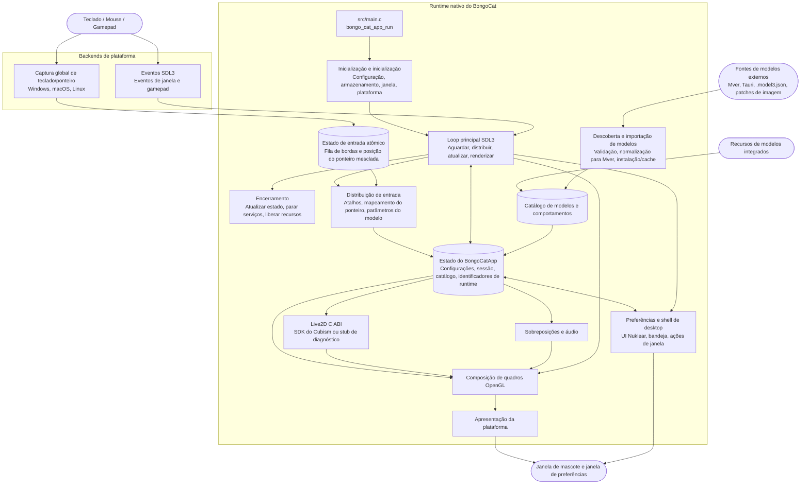

<div align="center">
  <a href="https://bongocat.pet" target="_blank">
    
  </a>
  <h1><a href="https://bongocat.pet" target="_blank">BongoCat</a></h1>
</div>

<p align="center">💘 C/C++ × SDL3 × OpenGL, misture tudo e bata à vontade! Bong~ Bongo Cat!!!</p>
<p align="center">
  Escolha o idioma ❯ <a href="https://github.com/vladelaina/BongoCat/blob/main/README.md">English</a> • <a href="https://github.com/vladelaina/BongoCat/blob/main/docs/README.zh-CN.md">简体中文</a> • <a href="https://github.com/vladelaina/BongoCat/blob/main/docs/README.zh-Hant.md">繁體中文</a> • <a href="https://github.com/vladelaina/BongoCat/blob/main/docs/README.fr-FR.md">Français</a> • <a href="https://github.com/vladelaina/BongoCat/blob/main/docs/README.de-DE.md">Deutsch</a> • <a href="https://github.com/vladelaina/BongoCat/blob/main/docs/README.ko-KR.md">한국어</a> • <strong>Português</strong> • <a href="https://github.com/vladelaina/BongoCat/blob/main/docs/README.ru-RU.md">Русский</a> • <a href="https://github.com/vladelaina/BongoCat/blob/main/docs/README.es-ES.md">Español</a> • <a href="https://github.com/vladelaina/BongoCat/blob/main/docs/README.id-ID.md">Bahasa Indonesia</a>
</p>
<p align="center">
  <a href="https://github.com/vladelaina/BongoCat/blob/main/LICENSE"></a>
  <a href="https://github.com/vladelaina/BongoCat"></a>
  <a href="https://discord.gg/vf8jqnattk"></a>
  <a href="https://github.com/vladelaina/BongoCat/blob/main/docs/wechat.png"></a>
  <a href="https://qm.qq.com/q/cYlRBbvuda"></a>
</p>

<div align="center"><video src="https://github.com/user-attachments/assets/75719230-9e49-4124-ae5a-8e35592c5d49" autoplay loop style="border-radius: 8px; max-width: 800px;"></video></div>

> [!TIP]
> O modelo usado na demonstração é de [宇痕冫](https://space.bilibili.com/348616056).
>
> 🎁 Procurando modelos **gratuitos**? Trabalhamos com criadores de modelos talentosos para trazer uma grande variedade de modelos gratuitos, enquanto exploramos continuamente experiências de desktop ainda mais divertidas! Visite nosso site oficial: [bongocat.pet](https://bongocat.pet/models)

<p align="center">
  <a href="https://bongocat.pet/models">
    
  </a>
</p>

<p align="center"></p>

## 💬 Comunidade QQ

Escaneie o código QR com o QQ ou procure o grupo **211957388** para participar da comunidade **BongoCat-X**.

<p align="center"></p>

## 📥 Download

<a href="https://apps.microsoft.com/detail/9p41mlsx72xw?referrer=appbadge" target="_self"></a>

- GitHub Releases ([v2.1.1](https://github.com/TianMengLucky/BongoCat-X/releases/tag/v2.1.1))

  Baixe a versão mais recente nas [GitHub Releases](https://github.com/TianMengLucky/BongoCat-X/releases/latest).

  > [!IMPORTANT]
  > As versões oficiais são **builds runtime-Core**: o suporte à renderização Live2D está embutido, mas a biblioteca de tempo de execução Live2D Cubism Core **não é incluída** (licença proprietária, nunca distribuída com os pacotes). **Não** são builds de diagnóstico sem Live2D. Quando nenhum Core é encontrado, o aplicativo volta para o backend de diagnóstico e mostra um aviso na janela de configurações.

  **Ativar a renderização Live2D (escolha uma opção):**

  1. **Importar pelo aplicativo (recomendado)**: abra *Configurações → Plugins*, clique em *Importar Live2D Core* e selecione um arquivo `Live2DCubismCore.dll` ou o zip oficial do SDK do Cubism. Tem efeito imediato, sem reiniciar.
  2. **Soltar na pasta live2d**: baixe o **Cubism SDK for Native** na [página oficial de download](https://www.live2d.com/en/sdk/download/native/) (é preciso aceitar a licença da Live2D) e coloque o zip ou o `Live2DCubismCore.dll` extraído na pasta `live2d` ao lado do aplicativo ou no diretório de dados; após reiniciar, ele é reconhecido automaticamente.

  Para os passos completos de importação do SDK ao compilar do código-fonte, consulte a seção «Live2D / Cubism SDK» abaixo.

## 🛠️ Compilar a partir do código-fonte

O BongoCat usa CMake e requer um compilador C11, um compilador C++17, CMake 3.24 ou superior, os arquivos de desenvolvimento de OpenGL para desktop e a toolchain do Rust (cargo, por exemplo via rustup): os analisadores críticos para a segurança de memória (SHA-256, decodificação de imagens, o feed de colaboradores e a decodificação de áudio) ficam no crate `src/rust/bongo-safe`, que o Corrosion compila durante a configuração. Por padrão, SDL3, stb, miniaudio e Nuklear são baixados automaticamente durante a configuração, portanto a primeira configuração requer conexão com a internet.

Execute os comandos abaixo na raiz do projeto (o diretório que contém `CMakeLists.txt`).

### 📋 Pré-requisitos por plataforma

- **Windows:** Visual Studio 2022 (com a carga de trabalho ‘Desenvolvimento para desktop com C++’) e CMake. Use o gerador MSVC; o MinGW pode compilar o backend de diagnóstico, mas não suporta o SDK do Cubism.
- **macOS:** Xcode Command Line Tools, CMake e Ninja. Se a arquitetura de destino for diferente da padrão do host, especifique-a por meio de `CMAKE_OSX_ARCHITECTURES`.
- **Linux (Debian/Ubuntu):** GCC ou Clang, Ninja e os cabeçalhos de OpenGL/X11:

  ```bash
  sudo apt-get update
  sudo apt-get install -y build-essential cmake ninja-build \
    libgl1-mesa-dev libx11-dev libxi-dev libxfixes-dev libcurl4-openssl-dev
  ```

### 🔧 Configuração e compilação

No Linux e no macOS, use um gerador de configuração única como o Ninja:

```bash
cmake -S . -B build -G Ninja \
  -DCMAKE_BUILD_TYPE=Release \
  -DBONGO_CAT_FETCH_DEPS=ON
cmake --build build --parallel
```

No Windows, execute os comandos no Prompt de Comando do Desenvolvedor do Visual Studio 2022 (ou em qualquer shell em que o MSVC esteja disponível):

```powershell
cmake -S . -B build -G "Visual Studio 17 2022" -A x64 `
  -DBONGO_CAT_FETCH_DEPS=ON
cmake --build build --config Release --parallel
```

O executável fica em `build/BongoCat` no Linux, em `build/BongoCat.app/Contents/MacOS/BongoCat` no macOS e em `build/Release/BongoCat.exe` para compilações do Visual Studio no Windows.

### 🧪 Testes

Os alvos do CTest estão habilitados por padrão. Execute o seguinte após compilar:

```bash
ctest --test-dir build --output-on-failure
```

Para um gerador de múltiplas configurações, como o Visual Studio, especifique explicitamente a configuração de compilação:

```powershell
ctest --test-dir build -C Release --output-on-failure
```

### 🎭 Live2D / SDK do Cubism (Opcional — compila mesmo sem ele)

O SDK proprietário do Cubism continua opcional. Sem ele, o aplicativo e o plugin Inox2D são compilados. Um plugin Live2D compatível e o Cubism Core fornecido pelo usuário ativam o Live2D sem recompilar o aplicativo. O SDK gera o plugin C++ separado.

1. Abra a [página de download do SDK do Cubism](https://www.live2d.com/en/sdk/download/native/), aceite o Live2D Proprietary Software License Agreement e baixe o **Cubism SDK for Native** (os releases são compilados e testados com o SDK `5-r.5`).
2. Extraia o arquivo. Se a pasta extraída se chamar `CubismSdkForNative-5-r.5`, renomeie-a para `CubismSdkForNative` e coloque-a em `vendor/` de modo que a árvore contenha `Core/` e `Framework/`.
3. Arquivos mais recentes do SDK não incluem mais o GLEW. Baixe o [GLEW 2.2.0](https://github.com/nigels-com/glew/releases/download/glew-2.2.0/glew-2.2.0.zip) e extraia-o em `vendor/CubismSdkForNative/Samples/OpenGL/thirdParty/glew` (o diretório que contém diretamente `include/GL/glew.h` e `src/glew.c`).

Você também pode manter o SDK em qualquer lugar e informar o caminho explicitamente:

```bash
cmake -S . -B build -G Ninja \
  -DCMAKE_BUILD_TYPE=Release \
  -DBONGO_CAT_CUBISM_SDK=/path/to/CubismSdkForNative
```

O SDK deve incluir a biblioteca Core, o código-fonte do Framework e o diretório de terceiros do OpenGL GLEW na estrutura esperada por `cmake/Cubism.cmake`. As compilações de Cubism no Windows exigem o Visual Studio 2022. Com o SDK no lugar, configure como de costume para obter uma compilação com renderização do Live2D; `BONGO_CAT_REQUIRE_CUBISM=ON` agora apenas faz a configuração falhar rapidamente com instruções de importação quando o SDK está ausente (a CI de releases usa essa opção). Deixe o padrão `OFF` quando não precisar disso.

> [!TIP]
> No Windows, é possível ativar a renderização do Live2D sem recompilar: abra
> Configurações → Modelo no aplicativo, clique em «Importar Live2D Core» e
> selecione um arquivo `Live2DCubismCore.dll` ou o zip oficial do SDK Cubism.
> A mudança entra em vigor imediatamente, sem reiniciar.

> [!NOTE]
> Os pacotes oficiais de Release deste repositório são compilações
> runtime-Core: eles incluem o renderizador do Live2D, mas **não** incluem
> o runtime do Core. Na inicialização, o aplicativo verifica a pasta
> `live2d` — coloque `Live2DCubismCore.dll` ou o zip oficial do SDK nela
> (ao lado do aplicativo ou dentro do diretório de dados) e ele será
> detectado automaticamente após uma reinicialização; você também pode
> clicar em «Importar Live2D Core» em Configurações → Modelo para ativá-lo
> imediatamente. Quando nenhum Core é encontrado, o aplicativo volta ao
> backend de diagnóstico e mostra uma dica na janela de configurações.

### ⚙️ Opções do CMake

| Opção | Valor padrão | Descrição |
| --- | --- | --- |
| `BONGO_CAT_FETCH_DEPS` | `ON` | Baixa dependências de terceiros em versões fixadas via `FetchContent` do CMake (incluindo Corrosion e as dependências do crate Rust). Defina como `OFF` apenas se SDL3, stb, miniaudio, Nuklear e Corrosion já estiverem disponíveis para o CMake. |
| `BONGO_CAT_CUBISM_SDK` | `vendor/CubismSdkForNative` | Caminho para o Cubism SDK for Native. |
| `BONGO_CAT_REQUIRE_CUBISM` | `OFF` | Define se a ausência do SDK faz a configuração falhar. Padrão `OFF`: sem o SDK, compila o backend de diagnóstico sem renderização do Live2D; defina `ON` para exigir o SDK (a CI de releases usa essa opção). |
| `BONGO_CAT_WARNINGS_AS_ERRORS` | `OFF` | Trata avisos do compilador nativo como erros. |

Para uma compilação offline, defina `BONGO_CAT_FETCH_DEPS=OFF` e forneça as configurações de pacote do CMake para SDL3 (incluindo `SDL3-static`) ; se stb, Nuklear e miniaudio não puderem ser detectados automaticamente, informe também seus diretórios de inclusão:

```bash
cmake -S . -B build -G Ninja \
  -DCMAKE_BUILD_TYPE=Release \
  -DBONGO_CAT_FETCH_DEPS=OFF \
  -DBONGO_CAT_STB_INCLUDE_DIR=/path/to/stb \
  -DBONGO_CAT_NUKLEAR_INCLUDE_DIR=/path/to/nuklear \
  -DBONGO_CAT_MINIAUDIO_INCLUDE_DIR=/path/to/miniaudio
```

## 📌 Status do projeto


## 📜 Licença

O código-fonte e o runtime nativo do BongoCat estão licenciados sob [AGPL-3.0-only](../LICENSE).

O modo de modelo integrado padrão (`standard`) permanece sob a licença MIT. Os recursos de modelo incluídos em `resources/assets/models/standard`, `keyboard` e `gamepad` são cobertos pela [declaração de licença MIT](../LICENSE-MIT) separada. Essa licença MIT se aplica apenas aos recursos dos modelos e às artes que os acompanham; ela não altera a licença do código-fonte nem do runtime nativo do BongoCat.

## 🧭 Arquitetura técnica

A versão nativa atual é construída com C/C++, SDL3 e OpenGL. O diagrama abaixo destaca o fluxo de dados em tempo de execução; consulte os arquivos do CMake para obter detalhes de compilação e empacotamento.

### 🔄 Propriedade do runtime e agendamento de quadros

Cada processo possui uma instância de `BongoCatApp` e um loop de eventos/renderização no thread principal. Os listeners de plataforma param na fronteira de entrada:

```text
Listeners de plataforma (teclado/ponteiro)
            |
            v
  Estado de entrada C11 (fila atômica de bordas + posição do ponteiro mesclada)
            |
            v
  aplicação no thread principal <----- eventos SDL3
            |
            v
  parâmetros do modelo, sobreposições e estado da interface
            |
            v
  atualização do modelo -> composição OpenGL -> apresentação da plataforma
```

O receptor Raw Input do Windows, o tap de eventos Quartz do macOS e os listeners XInput2 do Linux são executados fora do loop principal. Eventos de teclas e botões entram em uma fila atômica limitada; os movimentos são agrupados separadamente e eventos SDL despertam a thread principal. O Windows recebe entradas em segundo plano por uma janela de mensagens com `RIDEV_INPUTSINK | RIDEV_DEVNOTIFY`, preservando as mensagens comuns. Quando outro aplicativo oculta ou bloqueia o cursor, o modelo usa os movimentos do dispositivo; o SDL fornece a posição do cursor na área de trabalho. Estados pressionados são limpos ao desconectar um dispositivo ou mudar a área de trabalho de entrada. O Windows não usa mais hooks de entrada nem DirectInput. Eventos de janela, preferências e gamepad do SDL3 são processados na thread principal. Nenhum listener de plataforma chama diretamente o código de Live2D, sobreposições ou interface.

`bongo_cat_app_run` trata dos parâmetros de atualização, encerramento e processos secundários, impõe a propriedade de instância única do processo principal, aloca o estado do aplicativo, executa a inicialização, entra em `bongo_cat_app_loop` e, em seguida, atualiza o estado e destrói os recursos na ordem definida. A inicialização carrega a configuração e os caminhos de armazenamento, localiza os recursos, cria a janela de mascote SDL/OpenGL, inicializa os backends de plataforma, cria os serviços de Live2D/sobreposições/áudio, verifica fontes de modelos integradas/instaladas/próximas e carrega os modelos disponíveis. `BongoCatApp` mantém as configurações, o estado da sessão, os catálogos de modelos e comportamentos, os identificadores de plataforma e os identificadores de serviços de runtime.

Os pacotes de modelos instalados usam Mver como formato canônico. O processo de importação analisa o arquivo ou diretório selecionado, descobre e valida candidatos, gera uma impressão digital de identidade do pacote, converte fontes Tauri em Mver, aplica patches de imagem e envia o pacote normalizado para `models_root`. Em seguida, os adaptadores de runtime são gerados e o catálogo é atualizado. Fontes próximas são descobertas apenas sem instalar a árvore de origem; seus adaptadores e resultados de verificação são armazenados em cache sob `cache_root`, fora de `models_root`.

Cada iteração do loop principal espera ativações SDL/nativas ou o vencimento mais cedo dos prazos de quadro, interface, animação e acerto do ponteiro (máximo de 250 ms). O loop distribui os eventos SDL enfileirados, esvazia a fila de entrada atômica e executa a recuperação de liberação, atualiza o estado da janela e da atualização do modelo e, em seguida, aplica os parâmetros de entrada. Com o Cubism habilitado, o prazo do modelo segue `settings.model.max_fps` (padrão de 60 FPS); builds de diagnóstico usam um intervalo de reserva de 100 ms. O tempo decorrido do modelo é contado no máximo como 250 ms e dividido em até oito subetapas, cada uma com o objetivo de não mais que 1/30 de segundo.

O caminho normal da mascote é renderizado apenas quando a janela está visível, não minimizada e marcada como suja. Cada quadro primeiro limpa o fundo, desenha o modelo e então compõe as sobreposições de ponteiro, teclas e efeitos, e finalmente chama o apresentador da plataforma. As operações de visualização podem solicitar renderização imediata; a renderização de capturas de tela pode pular a apresentação. macOS e Linux trocam diretamente a janela SDL OpenGL; o Windows a troca diretamente quando a apresentação em camadas não está habilitada; caso contrário, lê o buffer de quadros e chama `UpdateLayeredWindow`. A interface de preferências tem sua própria janela SDL/OpenGL e é renderizada e apresentada separadamente.

O runtime C chama a ABI declarada em `include/bongo_cat/model.h`. A ponte Live2D e a implementação do Cubism estão em `src/live2d` e usam C++17 apenas quando o SDK do Cubism está habilitado; o restante do runtime nativo usa C11. Os tipos do Cubism são mantidos atrás de identificadores C opacos; quando o SDK não está disponível, `src/live2d/live2d_stub.c` fornece o backend de diagnóstico.



## ❓ Perguntas frequentes

### 🔒 O BongoCat registra minhas entradas de teclado ou mouse?

Não. O BongoCat processa entradas de teclado e mouse localmente para impulsionar animações e atalhos. Ele não registra nem envia teclas pressionadas, ações do mouse ou outros dados de interação. A configuração também é salva apenas localmente; o aplicativo não contém anúncios, ferramentas de análise nem código de rastreamento de usuários. Ao verificar atualizações, apenas metadados públicos de versão são solicitados; nenhum dado de entrada, configuração ou uso é enviado.

### 🖼️ Qual é o progresso do suporte a Vulkan / Metal?

Configurações → Aplicativo → Backend de renderização permite trocar imediatamente: OpenGL ↔ Vulkan no Windows / Linux x64 e OpenGL ↔ Metal no macOS. Sistema usa OpenGL por padrão. O envio de texturas nativas, desenho Cubism, leitura da GPU e recarga estão conectados; o modelo e movimentos/expressões selecionados são preservados. Falhas de inicialização ou recarga restauram OpenGL. Vulkan/Metal são experimentais: sobreposições de teclas/efeitos/ponteiro e atualização dinâmica assíncrona de texturas exigem OpenGL. Texturas nativas aplicam limites de qualidade/tamanho ao carregar. Os backends nativos armazenam o fundo de mesa em cache, o incluem no quadro ajustado e arredondam os quatro cantos na GPU sem outra textura de tela inteira.

A otimização de renderização grande vem desativada e mostra as funções ativadas; a troca recarrega o modelo. Inox2D Vulkan oferece gravação paralela e blocos grandes; Live2D Vulkan oferece alocações grandes com VMA. Cenas pequenas usam gravação serial. Bindless, computação assíncrona e gravação paralela de Live2D não estão implementados. OpenGL / Metal não oferecem essas funções. Pools maiores podem usar mais memória.

Compilações com SDK usam `BONGO_CAT_CUBISM_VULKAN=ON` no Windows / Linux x64 (`glslangValidator` ou `glslang`, pacote Linux `glslang-tools`; Vulkan 1.3 na execução) e `BONGO_CAT_CUBISM_METAL=ON` no macOS (ferramentas Metal do Xcode). Use `OFF` para desativar a extensão. Fontes Metal e `.metallib` entram apenas no macOS; Vulkan e `.spv` apenas no Windows / Linux x64, incluindo variantes de mistura. Compilações de diagnóstico sem SDK omitem esses recursos Live2D. GitHub Actions prepara as ferramentas e verifica recursos por plataforma. Verificações estáticas foram executadas; compilação e GPU ainda não foram validadas. Veja [integração e validação](live2d-vulkan-metal.md).

## 🙏 Agradecimentos especiais
> [!TIP]
> Cada passo do BongoCat é movido pelo espírito do código aberto. Agradecemos sinceramente a todos os colaboradores da comunidade por suas contribuições altruístas (listadas abaixo em ordem cronológica de contribuição). É o apoio de vocês que torna a companhia no desktop mais livre e genuína.❤️‍🔥


<a href="https://bongocat.pet">
    
</a>


[linux.do](https://linux.do/t/topic/2845597)
---

<div align="center">
Copyright © 2026 - **BongoCat**<br>
By vladelaina<br>
Made with ❤️ & ⌨️
</div>

### Plugins de renderização dinâmicos

Preferências → Plugins permite instalar, ativar e remover renderizadores locais. Mude para outro renderizador antes de alterar um plugin ativo. Live2D usa um plugin C++; Inochi2D usa o plugin Rust Inox2D com OpenGL, Vulkan (Windows/Linux) e Metal (macOS), sem wgpu. A importação identifica primeiro o conteúdo do modelo (`.model3.json`, `.inp`, `.inx`). Toda a leitura e escrita de JSON é feita em Rust.

As versões portáteis para Windows são arquivos ZIP. Mantenha a pasta extraída `plugins` ao lado do executável. Veja [Plugins de renderização](model-plugins.md) para empacotamento, dependências offline, ABI, mapeamento de parâmetros e limites de compatibilidade.

Cada push para `dev` que altera código, recursos ou configuração de compilação publica uma versão de pré-lançamento no GitHub. Alterações apenas na documentação são ignoradas; não há execução agendada. Todas as plataformas usam o commit enviado. A versão estável mais recente não é substituída.

As prévias noturnas reutilizam a [página nightly](https://github.com/TianMengLucky/BongoCat-X/releases/tag/nightly), atualizam a tag e substituem arquivos com nomes fixos. Plataformas com falha mantêm seus arquivos anteriores.

### Linux Wayland / evdev

A entrada evdev experimental no Linux Wayland é ativada com `BONGOCAT_ENABLE_EVDEV=1`. Primeiro, os dispositivos são abertos somente para leitura como usuário normal. Se o acesso for negado, uma instalação protegida solicita autenticação por `/usr/bin/sudo`, abre os dispositivos e reinicia após abandonar imediatamente os privilégios, antes de inicializar SDL, configurações e modelos. O programa, sudo e diretórios superiores devem pertencer a root e não permitir escrita pelo grupo ou outros usuários. Instalações de desenvolvimento e portáteis precisam de permissões administradas separadamente. O caminho confiável do sudo é configurável por `BONGO_CAT_SUDO_EXECUTABLE`. Falhas interrompem a inicialização; permissões permanentes não são alteradas. Apenas dispositivos presentes ao iniciar são monitorados; novas conexões exigem reiniciar. Não execute diretamente como root nem entre no grupo `input`. A entrada pode incluir senhas e não pausa ao bloquear a tela, trocar de sessão ou ocultar o pet.

[SECURITY.md](../SECURITY.md#linux-input)
