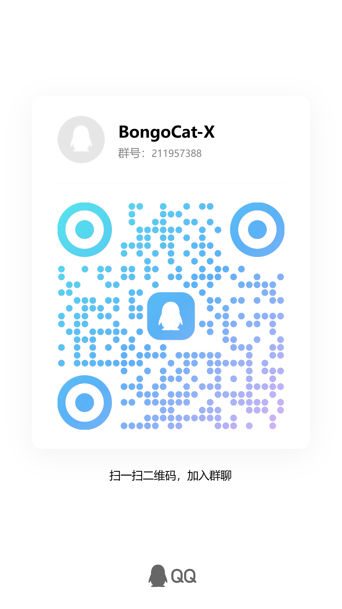
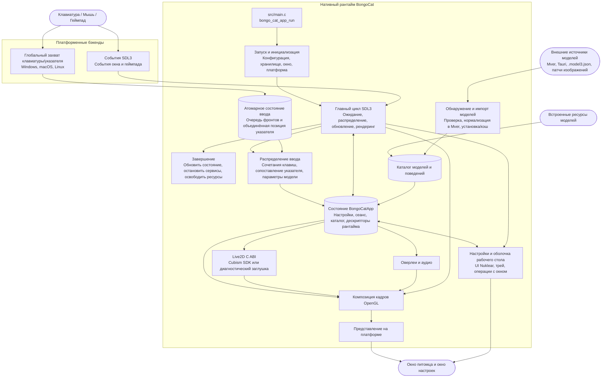

<div align="center">
  <a href="https://bongocat.pet" target="_blank">
    
  </a>
  <h1><a href="https://bongocat.pet" target="_blank">BongoCat</a></h1>
</div>

<p align="center">💘 C/C++ × SDL3 × OpenGL — смешай всё и барабань в своё удовольствие! Бонг~ Bongo Cat!!!</p>
<p align="center">
  Выберите язык ❯ <a href="https://github.com/vladelaina/BongoCat/blob/main/README.md">English</a> • <a href="https://github.com/vladelaina/BongoCat/blob/main/docs/README.zh-CN.md">简体中文</a> • <a href="https://github.com/vladelaina/BongoCat/blob/main/docs/README.zh-Hant.md">繁體中文</a> • <a href="https://github.com/vladelaina/BongoCat/blob/main/docs/README.fr-FR.md">Français</a> • <a href="https://github.com/vladelaina/BongoCat/blob/main/docs/README.de-DE.md">Deutsch</a> • <a href="https://github.com/vladelaina/BongoCat/blob/main/docs/README.ko-KR.md">한국어</a> • <a href="https://github.com/vladelaina/BongoCat/blob/main/docs/README.pt-BR.md">Português</a> • <strong>Русский</strong> • <a href="https://github.com/vladelaina/BongoCat/blob/main/docs/README.es-ES.md">Español</a> • <a href="https://github.com/vladelaina/BongoCat/blob/main/docs/README.id-ID.md">Bahasa Indonesia</a>
</p>
<p align="center">
  <a href="https://github.com/vladelaina/BongoCat/blob/main/LICENSE"></a>
  <a href="https://github.com/vladelaina/BongoCat"></a>
  <a href="https://discord.gg/vf8jqnattk"></a>
  <a href="https://github.com/vladelaina/BongoCat/blob/main/docs/wechat.png"></a>
  <a href="https://qm.qq.com/q/cYlRBbvuda"></a>
</p>

<div align="center"><video src="https://github.com/user-attachments/assets/75719230-9e49-4124-ae5a-8e35592c5d49" autoplay loop style="border-radius: 8px; max-width: 800px;"></video></div>

> [!TIP]
> Модель, использованная в демо, принадлежит [宇痕冫](https://space.bilibili.com/348616056).
>
> 🎁 Ищете **бесплатные** модели? Мы сотрудничаем с талантливыми создателями моделей, чтобы предложить вам широкий выбор бесплатных моделей, и постоянно исследуем новые интересные возможности для рабочего стола! Загляните на наш официальный сайт: [bongocat.pet](https://bongocat.pet/models)

<p align="center">
  <a href="https://bongocat.pet/models">
    
  </a>
</p>

<p align="center"></p>

## 💬 Сообщество QQ

Отсканируйте QR-код в QQ или найдите группу **211957388**, чтобы присоединиться к сообществу **BongoCat-X**.

<p align="center"></p>

## 📥 Загрузка

<a href="https://apps.microsoft.com/detail/9p41mlsx72xw?referrer=appbadge" target="_self"></a>

- GitHub Releases ([v2.1.2](https://github.com/TianMengLucky/BongoCat-X/releases/tag/v2.1.2))

  Скачайте последнюю версию из [GitHub Releases](https://github.com/TianMengLucky/BongoCat-X/releases/latest).

  > [!IMPORTANT]
  > Официальные сборки — это **runtime-Core сборки**: поддержка рендеринга Live2D встроена, но библиотека времени выполнения Live2D Cubism Core **не включена** (проприетарная лицензия, никогда не распространяется с пакетами). Это **не** диагностические сборки без Live2D. Если Core не обнаружен, приложение переключается на диагностический бэкенд и показывает подсказку в окне настроек.

  **Включить рендеринг Live2D (любой из способов):**

  1. **Импорт в приложении (рекомендуется)**: откройте *Настройки → Плагины*, нажмите *Импортировать Live2D Core* и выберите файл `Live2DCubismCore.dll` или официальный zip-архив Cubism SDK. Вступает в силу сразу, без перезапуска.
  2. **Поместить в папку live2d**: скачайте **Cubism SDK for Native** с [официальной страницы загрузки](https://www.live2d.com/en/sdk/download/native/) (нужно принять лицензию Live2D) и положите zip или распакованный `Live2DCubismCore.dll` в папку `live2d` рядом с приложением или в каталоге данных; после перезапуска он будет распознан автоматически.

  Полные шаги импорта SDK при сборке из исходников смотрите в разделе «Live2D / Cubism SDK» ниже.

## 🛠️ Сборка из исходного кода

BongoCat использует CMake и требует компилятор C11, компилятор C++17, CMake 3.24 или новее, файлы разработки OpenGL для настольных систем, а также инструментарий Rust (cargo, например через rustup): парсеры, критичные для безопасности памяти (SHA-256, декодирование изображений, лента участников, декодирование аудио), находятся в крейте `src/rust/bongo-safe`, который Corrosion собирает на этапе конфигурации. По умолчанию SDL3, stb, miniaudio и Nuklear загружаются автоматически на этапе конфигурации, поэтому для первой настройки требуется подключение к сети.

Выполните следующие команды в корневом каталоге проекта (каталоге, содержащем `CMakeLists.txt`).

### 📋 Предварительные требования по платформам

- **Windows:** Visual Studio 2022 (с рабочей нагрузкой «Разработка классических приложений на C++») и CMake. Используйте генератор MSVC; MinGW может собрать диагностический бэкенд, но не поддерживает Cubism SDK.
- **macOS:** Xcode Command Line Tools, CMake и Ninja. Если целевая архитектура отличается от архитектуры хоста по умолчанию, укажите её через `CMAKE_OSX_ARCHITECTURES`.
- **Linux (Debian/Ubuntu):** GCC или Clang, Ninja, а также заголовочные файлы OpenGL/X11:

  ```bash
  sudo apt-get update
  sudo apt-get install -y build-essential cmake ninja-build \
    libgl1-mesa-dev libx11-dev libxi-dev libxfixes-dev libcurl4-openssl-dev
  ```

### 🔧 Настройка и сборка

В Linux и macOS используйте генератор с одной конфигурацией, например Ninja:

```bash
cmake -S . -B build -G Ninja \
  -DCMAKE_BUILD_TYPE=Release \
  -DBONGO_CAT_FETCH_DEPS=ON
cmake --build build --parallel
```

В Windows выполняйте команды из командной строки разработчика Visual Studio 2022 (или любой другой оболочки, где доступен MSVC):

```powershell
cmake -S . -B build -G "Visual Studio 17 2022" -A x64 `
  -DBONGO_CAT_FETCH_DEPS=ON
cmake --build build --config Release --parallel
```

Исполняемый файл находится в `build/BongoCat` в Linux, в `build/BongoCat.app/Contents/MacOS/BongoCat` в macOS и в `build/Release/BongoCat.exe` для сборок Visual Studio в Windows.

### 🧪 Тестирование

Цели CTest включены по умолчанию. После сборки выполните:

```bash
ctest --test-dir build --output-on-failure
```

Для генератора с несколькими конфигурациями, такого как Visual Studio, явно укажите конфигурацию сборки:

```powershell
ctest --test-dir build -C Release --output-on-failure
```

### 🎭 Live2D / Cubism SDK (необязателен — сборка возможна и без него)

Проприетарный Cubism SDK остаётся необязательным. Без него собираются приложение и плагин Inox2D. Совместимый плагин Live2D и отдельно предоставленный Cubism Core включают Live2D без пересборки приложения. SDK нужен для сборки отдельного плагина C++.

1. Откройте [страницу загрузки Cubism SDK](https://www.live2d.com/en/sdk/download/native/), примите условия Live2D Proprietary Software License Agreement и скачайте **Cubism SDK for Native** (релизы собираются и тестируются с SDK `5-r.5`).
2. Распакуйте архив. Если распакованная папка называется `CubismSdkForNative-5-r.5`, переименуйте её в `CubismSdkForNative` и поместите в `vendor/` так, чтобы дерево содержало `Core/` и `Framework/`.
3. В новых архивах SDK больше нет GLEW. Скачайте [GLEW 2.2.0](https://github.com/nigels-com/glew/releases/download/glew-2.2.0/glew-2.2.0.zip) и распакуйте в `vendor/CubismSdkForNative/Samples/OpenGL/thirdParty/glew` (каталог, напрямую содержащий `include/GL/glew.h` и `src/glew.c`).

Также можно хранить SDK в любом месте и явно передать его путь:

```bash
cmake -S . -B build -G Ninja \
  -DCMAKE_BUILD_TYPE=Release \
  -DBONGO_CAT_CUBISM_SDK=/path/to/CubismSdkForNative
```

SDK должен включать библиотеку Core, исходный код Framework и каталог сторонних библиотек OpenGL GLEW в структуре, ожидаемой `cmake/Cubism.cmake`. Сборки Cubism в Windows требуют Visual Studio 2022. Когда SDK размещён, обычная конфигурация даёт сборку с рендерингом Live2D; `BONGO_CAT_REQUIRE_CUBISM=ON` теперь только завершает конфигурацию ошибкой с инструкцией по импорту, если SDK отсутствует (используется в release CI). Если это не нужно, оставьте значение по умолчанию `OFF`.

> [!TIP]
> В Windows можно включить рендеринг Live2D без пересборки: откройте в
> приложении «Настройки → Модель», нажмите «Импортировать Live2D Core» и
> выберите файл `Live2DCubismCore.dll` или официальный zip-архив Cubism SDK.
> Изменение вступает в силу сразу, перезапуск не требуется.

> [!NOTE]
> Официальные сборки Release этого репозитория являются сборками runtime-Core:
> они содержат рендерер Live2D, но **не** поставляют библиотеку Core. При
> запуске приложение проверяет папку `live2d` — поместите туда
> `Live2DCubismCore.dll` или официальный zip SDK (рядом с приложением или в
> каталоге данных), и он будет подхвачен автоматически после перезапуска;
> также можно нажать «Импортировать Live2D Core» в настройках (Настройки →
> Модель), чтобы активировать его сразу. Если Core не найден, приложение
> возвращается к диагностическому бэкенду и показывает подсказку в окне
> настроек.

### ⚙️ Параметры CMake

| Параметр | По умолчанию | Описание |
| --- | --- | --- |
| `BONGO_CAT_FETCH_DEPS` | `ON` | Загружает сторонние зависимости фиксированных версий через `FetchContent` CMake (включая Corrosion и зависимости Rust-крейта). Установите `OFF`, только если SDL3, stb, miniaudio, Nuklear и Corrosion уже доступны для CMake. |
| `BONGO_CAT_CUBISM_SDK` | `vendor/CubismSdkForNative` | Путь к Cubism SDK for Native. |
| `BONGO_CAT_REQUIRE_CUBISM` | `OFF` | Определяет, приводит ли отсутствие SDK к ошибке конфигурации. По умолчанию `OFF`: без SDK собирается диагностический бэкенд без рендеринга Live2D; установите `ON`, чтобы требовать SDK (используется в release CI). |
| `BONGO_CAT_WARNINGS_AS_ERRORS` | `OFF` | Обрабатывает предупреждения нативного компилятора как ошибки. |

Для автономной сборки установите `BONGO_CAT_FETCH_DEPS=OFF` и предоставьте конфигурации пакетов CMake для SDL3 (включая `SDL3-static`) ; если stb, Nuklear и miniaudio не могут быть найдены автоматически, укажите также их каталоги включения:

```bash
cmake -S . -B build -G Ninja \
  -DCMAKE_BUILD_TYPE=Release \
  -DBONGO_CAT_FETCH_DEPS=OFF \
  -DBONGO_CAT_STB_INCLUDE_DIR=/path/to/stb \
  -DBONGO_CAT_NUKLEAR_INCLUDE_DIR=/path/to/nuklear \
  -DBONGO_CAT_MINIAUDIO_INCLUDE_DIR=/path/to/miniaudio
```

## 📌 Статус проекта


## 📜 Лицензия

Исходный код и нативный рантайм BongoCat распространяются под лицензией [AGPL-3.0-only](../LICENSE).

Встроенный по умолчанию режим модели (`standard`) остаётся под лицензией MIT. Ресурсы моделей, входящие в `resources/assets/models/standard`, `keyboard` и `gamepad`, покрываются отдельным [объявлением о лицензии MIT](../LICENSE-MIT). Эта лицензия MIT распространяется только на ресурсы моделей и сопутствующие художественные материалы; она не меняет лицензию исходного кода или нативного рантайма BongoCat.

## 🧭 Техническая архитектура

Текущая нативная версия построена на C/C++, SDL3 и OpenGL. Диаграмма ниже акцентирует поток данных во время выполнения; подробности сборки и упаковки см. в файлах CMake.

### 🔄 Владение рантаймом и планирование кадров

Каждый процесс владеет экземпляром `BongoCatApp` и циклом событий/рендеринга в главном потоке. Платформенные слушатели останавливаются на границе ввода:

```text
Платформенные слушатели (клавиатура/указатель)
            |
            v
  Состояние ввода C11 (атомарная очередь фронтов + объединённая позиция указателя)
            |
            v
  приложение в главном потоке <----- события SDL3
            |
            v
  параметры модели, оверлеи и состояние интерфейса
            |
            v
  обновление модели -> композиция OpenGL -> представление на платформе
```

Приёмник Raw Input в Windows, обработчик событий Quartz в macOS и слушатели XInput2 в Linux работают вне главного цикла. События клавиш и кнопок поступают в ограниченную атомарную очередь; перемещения объединяются отдельно, а события SDL пробуждают главный поток. Windows получает фоновый ввод через окно сообщений с `RIDEV_INPUTSINK | RIDEV_DEVNOTIFY`, сохраняя обычные оконные сообщения. Когда другое приложение скрывает или блокирует курсор, модель использует перемещения устройства; SDL предоставляет положение курсора на рабочем столе. При отключении устройства или смене рабочего стола ввода состояния нажатий очищаются. Windows больше не использует перехватчики ввода или DirectInput. События окна, настроек и геймпада SDL3 обрабатываются в главном потоке. Платформенные слушатели не вызывают напрямую код Live2D, оверлеев или интерфейса.

`bongo_cat_app_run` обрабатывает параметры обновления, завершения и вторичных процессов, обеспечивает владение единственным экземпляром главного процесса, выделяет состояние приложения, выполняет инициализацию, входит в `bongo_cat_app_loop`, а затем обновляет состояние и уничтожает ресурсы в определённом порядке. Инициализация загружает конфигурацию и пути хранения, находит ресурсы, создаёт окно питомца SDL/OpenGL, инициализирует платформенные бэкенды, создаёт сервисы Live2D/оверлеев/аудио, сканирует встроенные/установленные/близлежащие источники моделей и загружает доступные модели. `BongoCatApp` хранит настройки, состояние сеанса, каталоги моделей и поведения, дескрипторы платформы и дескрипторы сервисов рантайма.

Установленные пакеты моделей используют Mver в качестве канонического формата. Процесс импорта анализирует выбранный файл или каталог, обнаруживает и проверяет кандидатов, формирует отпечаток идентичности пакета, преобразует источники Tauri в Mver, применяет патчи изображений и отправляет нормализованный пакет в `models_root`. Затем создаются адаптеры рантайма и обновляется каталог. Близлежащие источники обнаруживаются без установки их дерева исходников; их адаптеры и результаты проверок кэшируются в `cache_root` за пределами `models_root`.

Каждая итерация главного цикла ожидает пробуждения SDL/нативных событий или самого раннего срока кадра, интерфейса, анимации и попадания указателя (максимум 250 мс). Цикл распределяет поставленные в очередь события SDL, очищает атомарную очередь ввода и выполняет восстановление освобождений, обновляет состояние окна и обновления модели, а затем применяет входные параметры. При включённом Cubism срок модели следует `settings.model.max_fps` (по умолчанию 60 FPS); диагностические сборки используют резервный интервал 100 мс. Прошедшее время модели учитывается максимум 250 мс и делится на до восьми подшагов, каждый из которых не превышает 1/30 секунды.

Обычный путь питомца рендерится только тогда, когда окно видимо, не свёрнуто и помечено как изменённое. Каждый кадр сначала очищает фон, рисует модель, затем компонует оверлеи указателя, клавиш и эффектов и, наконец, вызывает презентер платформы. Операции предпросмотра могут запросить немедленный рендеринг; рендеринг скриншотов может пропустить представление. macOS и Linux напрямую обменивают окно SDL OpenGL; Windows обменивает его напрямую, если многослойное представление не включено, в противном случае считывает кадровый буфер и вызывает `UpdateLayeredWindow`. Интерфейс настроек имеет собственное окно SDL/OpenGL и рендерится и представляется отдельно.

Среда выполнения C вызывает ABI, объявленный в `include/bongo_cat/model.h`. Мост Live2D и реализация Cubism находятся в `src/live2d` и используют C++17 только при включённом Cubism SDK; остальной нативный рантайм использует C11. Типы Cubism остаются за непрозрачными дескрипторами C; когда SDK недоступен, `src/live2d/live2d_stub.c` предоставляет диагностический бэкенд.



## ❓ Часто задаваемые вопросы

### 🔒 Записывает ли BongoCat мой ввод с клавиатуры или мыши?

Нет. BongoCat обрабатывает ввод с клавиатуры и мыши локально для управления анимациями и сочетаниями клавиш. Он не записывает и не загружает нажатия клавиш, действия мыши или другие данные взаимодействия. Конфигурация также сохраняется только локально; приложение не содержит рекламы, аналитических инструментов или кода отслеживания пользователей. При проверке обновлений запрашиваются только публичные метаданные версии; никакие данные ввода, конфигурации или использования не отправляются.

### 🖼️ Каков прогресс поддержки Vulkan / Metal?

Настройки → Приложение → Бэкенд рендеринга переключает API без перезапуска: OpenGL ↔ Vulkan на Windows / Linux x64, OpenGL ↔ Metal на macOS. Системный вариант использует OpenGL. Подключены загрузка нативных текстур, отрисовка Cubism, чтение GPU и перезагрузка модели; модель и выбранные движения/выражения сохраняются. Ошибка инициализации или загрузки возвращает OpenGL. Vulkan/Metal экспериментальны: слои клавиш/эффектов/указателя и асинхронное динамическое обновление текстур пока требуют OpenGL. Нативные текстуры учитывают качество/размер при загрузке. Нативные бэкенды кэшируют фон стола, учитывают его в границах окна и скругляют четыре угла на GPU без дополнительной полноэкранной текстуры.

Оптимизация крупного рендеринга отображается только с Vulkan и по умолчанию выключена. Три подопции сохраняются отдельно; изменения перезагружают модель. Inox2D Vulkan поддерживает параллельную запись и крупные блоки памяти. Live2D Vulkan поддерживает VMA и параллельную запись при обычном смешивании, без внеэкранных узлов и высокоточных масок. Live2D использует вторичные буферы при 128 Drawable и до четырёх потоков при 128 снимках объектов для отрисовки; остальные модели сохраняют последовательный путь SDK. Live2D Vulkan Bindless использует таблицу до 64 текстур атласа при обычном смешивании без внеэкранных узлов; при недостатке возможностей устройства или ёмкости сохраняется прежний путь. Inox2D Bindless не реализован. Крупные пулы могут потреблять больше памяти; прирост производительности ещё не измерен.

Сборки с SDK включают `BONGO_CAT_CUBISM_VULKAN=ON` на Windows / Linux x64 (`glslangValidator` или `glslang`, пакет Linux `glslang-tools`; при запуске Vulkan 1.3) и `BONGO_CAT_CUBISM_METAL=ON` на macOS (инструменты Metal из Xcode). Для отключения используйте `OFF`. Metal и `.metallib` включаются только в macOS, Vulkan и `.spv` — только в Windows / Linux x64, вместе с вариантами смешивания. Диагностические сборки без SDK не включают эти ресурсы Live2D. GitHub Actions готовит инструменты и проверяет ресурсы для каждой платформы. Выполнены статические проверки; сборка и GPU ещё не проверены. См. [интеграцию и проверку](live2d-vulkan-metal.md).

## 🙏 Особая благодарность
> [!TIP]
> Каждый шаг BongoCat вдохновлён духом открытого исходного кода. Мы искренне благодарим всех участников сообщества за их бескорыстный вклад (перечислен ниже в хронологическом порядке). Именно ваша поддержка делает настольного спутника более свободным и искренним.❤️‍🔥


<a href="https://bongocat.pet">
    
</a>


[linux.do](https://linux.do/t/topic/2845597)
---

<div align="center">
Авторские права © 2026 - **BongoCat**<br>
By vladelaina<br>
Made with ❤️ & ⌨️
</div>

### Динамические плагины рендеринга

Настройки → Плагины позволяют устанавливать, включать и удалять локальные движки рендеринга. Перед изменением активного плагина переключитесь на другой движок. Live2D использует плагин на C++, а Inochi2D — Rust-плагин Inox2D с OpenGL, Vulkan (Windows/Linux) и Metal (macOS), без wgpu. При импорте сначала определяется содержимое модели (`.model3.json`, `.inp`, `.inx`). Весь JSON читается и записывается в Rust.

Портативные версии Windows распространяются в ZIP-архивах. Сохраните распакованную папку `plugins` рядом с исполняемым файлом. Подробнее об упаковке, зависимостях для автономной сборки, ABI, привязках параметров и ограничениях совместимости: [Плагины рендеринга](model-plugins.md).

Каждый push в `dev`, изменяющий код, ресурсы или конфигурацию сборки, публикует предварительный выпуск GitHub. Изменения только документации пропускаются; запуска по расписанию нет. Все платформы собирают отправленный коммит. Последний стабильный выпуск не заменяется.

Ночные предварительные сборки используют одну [страницу nightly](https://github.com/TianMengLucky/BongoCat-X/releases/tag/nightly), обновляют тег и заменяют файлы с постоянными именами. При сбое сборки платформы сохраняются предыдущие файлы.

### Linux Wayland / evdev

Экспериментальный ввод evdev в Linux Wayland включается через `BONGOCAT_ENABLE_EVDEV=1`. Сначала устройства открываются обычным пользователем только для чтения. При отказе защищённая установка запрашивает аутентификацию через `/usr/bin/sudo`, открывает устройства, немедленно сбрасывает привилегии и перезапускается до инициализации SDL, настроек и моделей. Программа, sudo и родительские каталоги должны принадлежать root и запрещать запись группе и другим пользователям. Для сборок разработки и переносных установок доступ настраивает администратор отдельно. Путь sudo задаётся через `BONGO_CAT_SUDO_EXECUTABLE`. Ошибка останавливает запуск; постоянные права не меняются. Отслеживаются только устройства, присутствующие при запуске; подключение новых требует перезапуска. Не запускайте напрямую от root и не вступайте в группу `input`. Ввод может содержать пароли; блокировка экрана, смена сеанса и скрытие питомца не останавливают наблюдение.

[SECURITY.md](../SECURITY.md#linux-input)

В настройках окна можно выбрать свой фон: PNG, JPEG, WebP, BMP или GIF (первый кадр). Изображение заполняет окно по центру с сохранением пропорций; оно и одноцветный фон взаимно исключают друг друга. Копия хранится в каталоге данных приложения и доступна после перемещения оригинала. Ограничения: 64 МБ и 16 мегапикселей. Поддерживаются OpenGL, Vulkan и Metal.
